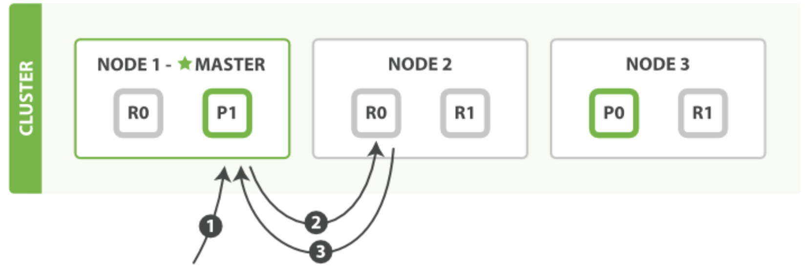
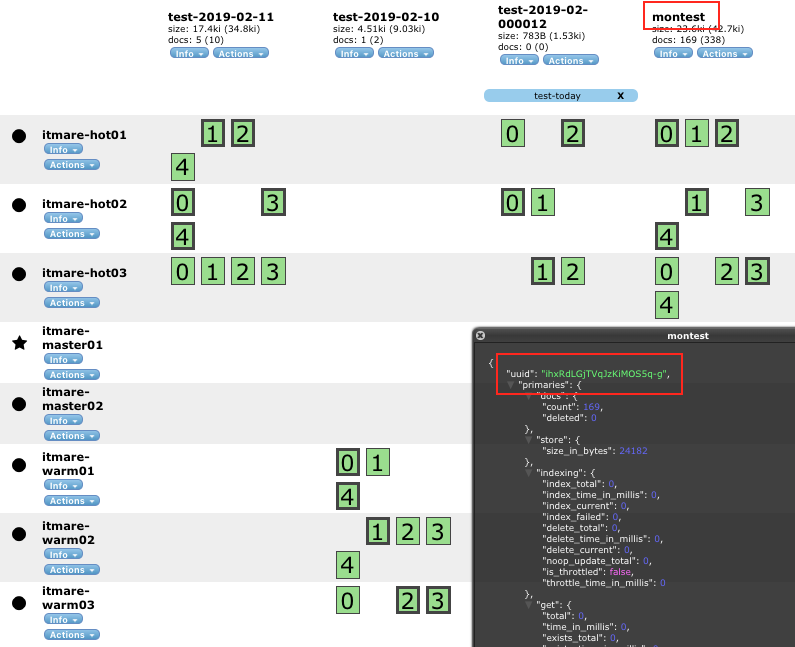
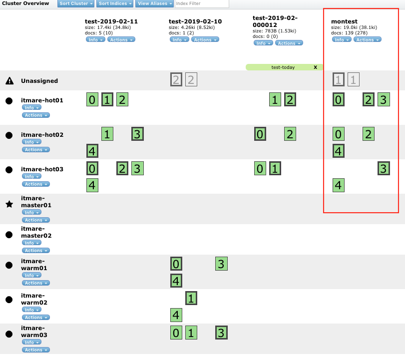

elasticsearch 이론 정리중

<br><br>

### Part 1. Elasticsearch 시작하기

-	[**Elasticsearch 기본 개념**](https://github.com/itmare/es_lecture#part-1-elasticsearch-%EC%8B%9C%EC%9E%91%ED%95%98%EA%B8%B0-1)

	-	[Elasticsearch에 대하여](https://github.com/itmare/es_lecture#elasticsearch%EC%97%90-%EB%8C%80%ED%95%98%EC%97%AC)
	-	[Elasticsearch의 용어 및 개념 정리](https://github.com/itmare/es_lecture#elasticsearch-%EC%9A%A9%EC%96%B4-%EB%B0%8F-%EA%B0%9C%EB%85%90%EC%A0%95%EB%A6%AC)

-	[**Elasticsearch 설치**](https://github.com/itmare/es#elasticsearch-%EC%84%A4%EC%B9%98)

	-	[repo 등록 설치](https://github.com/itmare/es#1-repo-%EB%93%B1%EB%A1%9D-%EC%84%A4%EC%B9%98)
	-	[RPM으로 설치](https://github.com/itmare/es#2-rpm%EC%9C%BC%EB%A1%9C-%EC%84%A4%EC%B9%98)
	-	[zip, tar로 설치](https://github.com/itmare/es#3-zip-tar%EB%A1%9C-%EC%84%A4%EC%B9%98)

-	[**Elasticsearch 기본 동작**](https://github.com/itmare/es_lecture#elasticsearch-%EA%B8%B0%EB%B3%B8-%EB%8F%99%EC%9E%91)

	-	[인덱스 생성 및 삭제, 조회](https://github.com/itmare/es_lecture#%EC%9D%B8%EB%8D%B1%EC%8A%A4-%EC%83%9D%EC%84%B1-%EB%B0%8F-%EC%82%AD%EC%A0%9C-%EC%A1%B0%ED%9A%8C)
	-	[문서 색인 및 조회](https://github.com/itmare/es_lecture#%EB%AC%B8%EC%84%9C-%EC%83%89%EC%9D%B8-%EB%B0%8F-%EC%A1%B0%ED%9A%8C)
	-	[문서 갱신 및 삭제](https://github.com/itmare/es#%EB%AC%B8%EC%84%9C-%EA%B0%B1%EC%8B%A0-%EB%B0%8F-%EC%82%AD%EC%A0%9C)

-	[**Elasticsearch 플러그인**](https://github.com/itmare/es_lecture#elasticsearch-%ED%94%84%EB%9F%AC%EA%B7%B8%EC%9D%B8)

	-	플러그인이란?
	-	플러그인의 설치
	-	[한눈에 클러스터를 보기 위한 head 플러그인 활용](https://github.com/itmare/es#elasticsearch-head)
	-	[클러스터의 사용률을 보기 위한 HQ 플러그인 활용](https://github.com/itmare/es#elasticsearch-hq)

<br>

### Part 2. Elasticsearch Basic Usage

-	[**Elasticsearch 환경 설정**](https://github.com/itmare/es_lecture#elasticsearch-%ED%99%98%EA%B2%BD%EC%84%A4%EC%A0%95)

	-	[Elasticsearch의 핵심인 elasticsearch.yml 설정](https://github.com/itmare/es_lecture#1-static-settings-elasticsearchyml)
	-	[힙사이즈의 중요성, jvm.options](https://github.com/itmare/es_lecture#2-static-settings-jvmoptions)
	-	[로그를 어떻게 모을 것인지 설정하는 log4j2.properties](https://github.com/itmare/es_lecture#3-static-settings-log4j2properties)

-	**Elasticsearch 클러스터 운영**

	-	[무중단 운영을 위한 rolling restart](https://github.com/itmare/es_lecture#rolling-restart)
	-	[안정적인 성능 제공을 위한 샤드 분배 방법](https://github.com/itmare/es_lecture#shard-allocation)
	-	[index setting](https://github.com/itmare/es_lecture#index-setting)
	-	[미리 정의된 template으로 인덱싱하기](https://github.com/itmare/es_lecture#template)
	-	[비용을 절감하는 운영 방법 hot-warm data node](https://github.com/itmare/es_lecture#hot-warm-data-node)

-	**Elasticsearch API 활용하기**

	-	[클러스터 운영 \_cluster API](https://github.com/itmare/es_lecture#cluster-api---%ED%81%B4%EB%9F%AC%EC%8A%A4%ED%84%B0-%EC%9A%B4%EC%98%81-api-%EB%8B%A4%EB%A3%A8%EA%B8%B0)
	-	[클러스터 인덱스 마이그레이션 \_reindex API](https://github.com/itmare/es_lecture#reindex-api---%EB%8D%B0%EC%9D%B4%ED%84%B0-%EB%A7%88%EC%9D%B4%EA%B7%B8%EB%A0%88%EC%9D%B4%EC%85%98)
	-	[벌크 인덱싱 \_bulk API](https://github.com/itmare/es_lecture#bulk-api---%EB%8F%84%ED%81%90%EB%A8%BC%ED%8A%B8-%ED%95%9C%EB%B2%88%EC%97%90-%EC%9D%B8%EB%8D%B1%EC%8B%B1%ED%95%98%EA%B8%B0)
	-	[그 외 운영에 유용한 APIs](https://github.com/itmare/es_lecture#%EA%B7%B8-%EC%99%B8-%EC%9A%B4%EC%98%81%EC%97%90-%EC%9C%A0%EC%9A%A9%ED%95%9C-api)

<br>

### Part 3. Elasticsearch Advanced Usage

-	[**검색엔진으로 Elasticsearch 활용하기**](https://github.com/itmare/es_lecture#%EA%B2%80%EC%83%89%EC%97%94%EC%A7%84%EC%9C%BC%EB%A1%9C-elasticsearch-%ED%99%9C%EC%9A%A9%ED%95%98%EA%B8%B0)

	-	[인덱스 생성 과정](https://github.com/itmare/es_lecture#%EC%9D%B8%EB%8D%B1%EC%8A%A4-%EC%83%9D%EC%84%B1-%EA%B3%BC%EC%A0%95)
	-	[분석기 변경 방법](https://github.com/itmare/es_lecture#%EB%B6%84%EC%84%9D%EA%B8%B0-%EB%B3%80%EA%B2%BD-%EB%B0%A9%EB%B2%95)
	-	[쿼리 생성](https://github.com/itmare/es_lecture#%EC%BF%BC%EB%A6%AC-%EC%83%9D%EC%84%B1)

-	[**Elasticsearch 색인 기능 최적화**](https://github.com/itmare/es_lecture#elasticsearch-%EC%83%89%EC%9D%B8-%EC%84%B1%EB%8A%A5-%EC%B5%9C%EC%A0%81%ED%99%94)

	-	[필요하지 않다면 쓰지 말아야 할 기능들, \_all 필드](https://github.com/itmare/es_lecture#%ED%95%84%EC%9A%94%ED%95%98%EC%A7%80-%EC%95%8A%EB%8B%A4%EB%A9%B4-%EC%93%B0%EC%A7%80-%EB%A7%90%EC%95%84%EC%95%BC-%ED%95%A0-%EA%B8%B0%EB%8A%A5%EB%93%A4-_all-%ED%95%84%EB%93%9C)
	-	[미리 정해놓은 스키마로 리소스를 절약할 수 있는 static mapping 적용하기](https://github.com/itmare/es_lecture#%EB%AF%B8%EB%A6%AC-%EC%A0%95%ED%95%B4%EB%86%93%EC%9D%80-%EC%8A%A4%ED%82%A4%EB%A7%88%EB%A1%9C-%EB%A6%AC%EC%86%8C%EC%8A%A4%EB%A5%BC-%EC%A0%88%EC%95%BD%ED%95%A0-%EC%88%98-%EC%9E%88%EB%8A%94-static-mapping-%EC%A0%81%EC%9A%A9%ED%95%98%EA%B8%B0)
	-	[인덱싱 된 데이터를 검색 결과에 반영할 수 있도록 refresh_interval 변경하기](https://github.com/itmare/es_lecture#%EC%9D%B8%EB%8D%B1%EC%8B%B1-%EB%90%9C-%EB%8D%B0%EC%9D%B4%ED%84%B0%EB%A5%BC-%EA%B2%80%EC%83%89-%EA%B2%B0%EA%B3%BC%EC%97%90-%EB%B0%98%EC%98%81%ED%95%A0-%EC%88%98-%EC%9E%88%EB%8F%84%EB%A1%9D-refresh_interval-%EB%B3%80%EA%B2%BD%ED%95%98%EA%B8%B0)

-	[**Elasticsearch 검색 성능 최적화**](https://github.com/itmare/es_lecture#elasticsearch-%EA%B2%80%EC%83%89-%EC%84%B1%EB%8A%A5-%EC%B5%9C%EC%A0%81%ED%99%94)

	-	[쿼리 튜닝 하기: 검색에 유리한 튜닝방법](https://github.com/itmare/es_lecture#%EC%BF%BC%EB%A6%AC-%ED%8A%9C%EB%8B%9D-%ED%95%98%EA%B8%B0-%EA%B2%80%EC%83%89%EC%97%90-%EC%9C%A0%EB%A6%AC%ED%95%9C-%ED%8A%9C%EB%8B%9D%EB%B0%A9%EB%B2%95)
	-	[샤드 배치 결정하기: 검색 성능을 위해 샤드 배치를 결정하는 노하우](https://github.com/itmare/es_lecture#%EC%83%A4%EB%93%9C-%EB%B0%B0%EC%B9%98-%EA%B2%B0%EC%A0%95%ED%95%98%EA%B8%B0-%EA%B2%80%EC%83%89%EC%84%B1%EB%8A%A5%EC%9D%84-%EC%9C%84%ED%95%B4-%EC%83%A4%EB%93%9C%EB%A5%BC-%EB%B0%B0%EC%B9%98%ED%95%98%EB%8A%94-%EB%85%B8%ED%95%98%EC%9A%B0)

-	[**Elasticsearch 모니터링**](https://github.com/itmare/es_lecture#elasticsearch-%EB%AA%A8%EB%8B%88%ED%84%B0%EB%A7%81)

	-	[rejected, 데이터의 누락이 발생하는 순간](https://github.com/itmare/es_lecture#rejected-%EB%8D%B0%EC%9D%B4%ED%84%B0%EC%9D%98-%EB%88%84%EB%9D%BD%EC%9D%B4-%EB%B0%9C%EC%83%9D%ED%95%98%EB%8A%94-%EC%88%9C%EA%B0%84)
	-	[\_cat API로 클러스터 상태 모니터링 하기](https://github.com/itmare/es_lecture#_cat-api%EB%A1%9C-%ED%81%B4%EB%9F%AC%EC%8A%A4%ED%84%B0-%EC%83%81%ED%83%9C-%EB%AA%A8%EB%8B%88%ED%84%B0%EB%A7%81-%ED%95%98%EA%B8%B0)
	-	[\_stats, \_nodes API로 클러스터의 리소스 사용 지표 모니터링 하기](https://github.com/itmare/es_lecture#_stats-_nodes-api%EB%A1%9C-%ED%81%B4%EB%9F%AC%EC%8A%A4%ED%84%B0%EC%9D%98-%EB%A6%AC%EC%86%8C%EC%8A%A4-%EC%82%AC%EC%9A%A9-%EC%A7%80%ED%91%9C-%EB%AA%A8%EB%8B%88%ED%84%B0%EB%A7%81-%ED%95%98%EA%B8%B0)

-	**Elasticsearch 성능 테스트**

	-	[성능 테스트 시나리오](https://github.com/itmare/es_lecture#%EC%84%B1%EB%8A%A5-%ED%85%8C%EC%8A%A4%ED%8A%B8-%EC%8B%9C%EB%82%98%EB%A6%AC%EC%98%A4)
	-	[성능 테스트 환경](https://github.com/itmare/es_lecture#%EC%84%B1%EB%8A%A5-%ED%85%8C%EC%8A%A4%ED%8A%B8-%ED%99%98%EA%B2%BD)
	-	[성능 테스트 결과 해석](https://github.com/itmare/es_lecture#%EC%84%B1%EB%8A%A5-%ED%85%8C%EC%8A%A4%ED%8A%B8-%EA%B2%B0%EA%B3%BC-%ED%95%B4%EC%84%9D)

<br><br><br><br><br><br>

---

Part 1. Elasticsearch 시작하기
==============================

---

<br><br>

Elasticsearch 기본 개념
=======================

<br><br>

### Elasticsearch에 대하여

-	Elasticsearch: 고가용성의 확장 가능한 오픈소스
-	자료 쌓아두고 필요한 자료를 빠르게 검색할 수 있도록 해주는 도구
-	RESTful방식의 Native API를 제공하고 다양한 프로그래밍 언어를 위한 API도 제공
-	Native API의 장단점
	-	장점: 쉽게 사용 가능하다.
	-	단점: Json형태의 검색문을 직접 작성해야 한다.

##### 1. Full-text 검색엔진으로서의 ES

-	루씬(Lucene)

	-	apache software재단의 검색엔진 상위 프로젝트
	-	java언어로 이루어진 정보 검색 라이브러리
	-	free open-source software, Doug Cutting에 의해 개발
	-	apache license하에 배포

-	단독 서비스

-	ES는 Shay banon이 Lucene기반으로 만든 검색엔진

-	apache 2.0 license에 의거

-	HTTP Web Interface와 Schema에 자유로운 Json형태의 도큐먼트 지원

-	준 실시간 분산형 검색엔진

##### 2. 분석엔진으로서의 ES

-	검색엔진으로서의 ES에, 몇가지 솔수션을 추가해 분석엔진으로 활용
-	semi-realtime 분석 엔진으로 사용 가능
-	beats: log나 data의 원본을 elasticsearch 로 전달
-	Logstash: 직접 log를 전달하거나 beats에서 데이터 전달받아 파싱이나 필터링하여 es에 전달
-	kibana: es에 수집된 데이터를 통계/집계 내어 시각화


<br><br>

### Elasticsearch 용어 및 개념정리

#### Json

-	사람이 읽고 쓰기 쉬운 형태의 경량 데이터 구조
-	Key:Value의 쌍으로 사용
-	Value에는 Key:Value형태의 object나 list도 들어갈 수 있음

<br><br>

#### cluster

-	es는 클러스터로 구성, 클러스터는 하나 이상의 노드로 구성
-	사용자는 클러스터를 통해 데이터를 밀어넣고 검색요청 한다.
-	클러스터는 고유의 cluster_name과 cluster_uuid를 갖고 운영된다.

<br><br>

#### node

-	노드는 클러스터를 구성하는 es프로세스
-	서로 헬스 체크를 하거나, 실제 데이터가 인덱싱 되어 적재
-	클라이언트의 검색 요청에 의해 데이터를 리턴
-	노드는 각자의 node_name과 node_uuid를 갖는다.
-	역할에 따라 여러가지 노드로 사용

	-	master_node
		-	클러스터 구성의 기준
		-	구성 노드들의 헬스 체크를 담당
	-	data_node
		-	실제 데이터가 적재되고 클라이언트의 요청에 데이터 리턴을 담당
	-	all_node

		-	master와 data의 구분이 필요없을때, 두가지 역할을 전부 담당
		-	확장이 거의 필요없고 비용 절감을 위해 사용

	-	client_node

		-	쿼리만을 받기 위한 노드
		-	master,data,all node들이 쿼리를 받을 수 있기 때문에 부하 분산용으로 쓰임

<br><br>

#### Index

-	
-	도큐먼트들의 모음
-	RDB의 데이터베이스와 비슷한 개념
-	여러 도큐먼트들이 하나의 인덱스에 적재
-	사전에 정의되어야 할 데이터의 타입이나 특정한 구조가 필용하지 않다면 최초 데이터가 들어올때 자동 생성된다.

<br><br>

#### Type

-	
-	타입은 인덱스의 파티션으로 사용
-	RDB의 테이블과 비슷한 개념
-	하나의 인덱스에 도큐먼트를 넣을 때 타입을 분리해서 인덱싱 가능
-	하나의 인덱스에 단일 타입 권고 (\_doc)
-	es 6.x부터 천천히 deprecated (6.0: 매핑 타입 삭제, 7.0: 완전 타입 삭제)
	-	루신엔진 특성상 인덱스(DB)에 여러개의 타입이 들어가 있어도 모든 매핑 정보가 생성되어 저장되어진다.
	-	완전 상이한 데이터가 들어 갈 경우 광장히 비효적일 수 밖에 없다.
	-	따라서 여러개의 타입이 들어가더라도 내부적으론 같기 때문에 타입을 삭제하기로 
	-	[(참고1: removal of mappings)](https://www.elastic.co/guide/en/elasticsearch/reference/master/removal-of-types.html)
	-	[(참고2: what is type and why they decided type will be deprecated)](https://medium.com/@federicopanini/elasticsearch-6-0-removal-of-mapping-types-526a67ff772)

<br><br>

#### Document

-	es 저장 기본단위
-	RDB의 columns나 rows와 비슷한 개념
-	도큐먼트는 데이터로 적재될 때 Document ID를 갖는다.
-	Doc ID는 기본적으로 랜덤하게 생성되지만, 필요에 의해 사용자 정의된 값으로도 생성 가능
-	Doc ID는 데이터를 찾아가는 메타데이터라 보면 된다.

<br><br>

#### Shard

-	인덱스의 데이터를 나누는 단위
-	무한정 데이터를 인덱스에 넣다보면 문제 발생
	-	단일 노드의 디스크 볼륨 크기의 유한성으로 더 이상 저장 불가 상황이 오게 됨
	-	단일 노드의 유한한 CPU, 혹은 memory자원으로 indexing이나 searching의 성능 저하
-	이런 문제 해결위해, ES에 도입된 개념이 샤딩
-	인덱스에 들어오는 도큐멘트들을 관계형 데이터베이스처럼 컬럼별로 나누는 vertical이 아닌, 문서별로 횡(horizontal)으로 나눠 샤드에 저장
-	primary shard
	-	인덱싱되어 들어온 도큐먼트의 원본 샤드
	-	es에 도큐먼트가 인덱싱 될 때, 가장 처음 생성되는 샤드
	-	샤드에는 넘버가 있어 몇 번째 샤드인지 식별 가능
	-	한번 지정한 샤드 갯수는 불변
	-	ES 6.x기준, 별도 설정하지 않으면 5개의 primary shard가 default (7.x부터 1로 변경 예정)
-	replica shard
	-	primary shard의 복제샤드를 의미
	-	primary shard 인덱싱 후, 복제 시작
	-	replica shard에 넘버링 하여 어떤 primary shard의 복제본인지 식별 가능
	-	별도 설정하지 않으면 1개의 replica shard가 default
-	각 es shard는 Lucene 인덱스
-	단일 Lucene 인덱스가 포함할 수 있는 문서 수의 최대 한도가 2,147,483,519건
-	replica shard가 있기 때문에 샤드/노드 오류가 발생하더라도 es클러스터 고가용성이 유지된다.
-	모든 replica shard에서 병렬 방식으로 검색을 실행할 수 있으므로 검색 처리량 확장 가능
-	단점: 인덱싱 할 때 primary샤드의 복제를 하는 과정이 추가되기 때문에
	1.	I/O가 두배로 발생하기 때문에 인덱싱 성능 저하
	2.	디스크 볼륨도 실제 도큐먼트의 두배 필요

<kbd></kdb>

-	싱글 노드에 3개의 샤드로 클러스터 구성
-	시간 지날수록, 문서는 점점 늘어난다. 결국 싱글노드의 허용 볼륨 모두 소진
-	클러스터에 더 이상 데이터 적재 불가

<kbd></kdb>

-	동일한 설정의 노드 한대 추가
-	es클러스터가 일정 샤드들을 새로 투입된 노드로 분배
-	두대의 노드가 인덱싱 및 검색 응답에 참여

<kbd></kdb>

-	노드가 한대 fail날 경우, 데이터의 안정성 보장 불가
-	복제본인 replica shard 추가

<kbd></kdb>

-	노드 한대 fail시, 남아있는 나머지 노드들의 replica shard가 primary shard로 승격됨
-	fail된 노드의 replica shard는 남아있는 나머지 노드들의 primary shard를 재복제하여 replica shard를 만듦

<br><br>

#### Segment

-	샤드는 다시 세그먼트로 나눠짐
-	도큐먼트가 인덱싱될 때, 그 데이터가 시스템 버퍼 캐시 영역으로 적재됨
-	이후, 데이터를 디스크의 세그먼트에 기록
-	이 과정에서 refresh를 거쳐야 commit point를 생성하여 검색 가능한 상태로 전환  

<br><br>

#### es 데이터 구조


-	각각의 샤드는 루씬 인덱스

<br><br>

#### RDBMS와 비교

| RDBMS    | Elasticsearch |
|:--------:|:-------------:|
|  schema  |    mapping    |
| database |     index     |
|  table   |     type      |
|   row    |   document    |
|  column  |     field     |

<br><br>

#### es 클러스터 구조

##### Cluster > node > index > type > document

###### - 예시1


<br><br>

###### - 예시2


| 이름     | 개수 |
|:--------:|:----:|
|  index   |  1   |
| instance |  3   |
|  shard   |  4   |
| replica  |  2   |

-	es는 클러스터 구조로 구성되어 있으며 샤드와 복제본의 수 설정에 따라 각 노드에 스스로 샤드를 분배하여 장애 발생 시, 데이터 손실을 최소화

<br><br><br><br><br>

<br><br>

Elasticsearch 기본 동작
=======================

<br><br>

인덱스 생성 및 삭제, 조회
-------------------------

-	기본사용 되는 커맨드

```shell
# 모든 default 설정과 함께 twitter index가 생성된다.
PUT twitter
```

#### 인덱스 생성 3가지 방법

##### 1. 인덱스의 "settings"를 정의

1.	static index settings
	-	number_of_shards : primary 샤드 갯수 설정
2.	Dynamic index settings

	-	number_of_replicas : replica 샤드 갯수 설정
	-	refresh_interval : 검색 commit point를 만드는 refresh interval 설정
	-	cluster.routing.allocation.enable : 인덱스의 샤드들의 라우팅 허용 설정

```java
// ex)
PUT twitter
{
    "settings" : {
        "index" : {
            "number_of_shards" : 3,
            "number_of_replicas" : 2
        }
    }
}

// 간단하게
PUT twitter
{
    "settings" : {
        "number_of_shards" : 3,
        "number_of_replicas" : 2
    }
}
```

##### 2. 인덱스의 mappings를 정의

```java
// ex)
PUT test
{
    "settings" : {
        "number_of_shards" : 1
    },
    "mappings" : {
        "_doc" : {
            "properties" : {
                "field1" : { "type" : "text" }
            }
        }
    }
}
```

##### 3. 사용자 정의된 도큐먼트를 인덱싱

-	alias등 사용 가능

<br><br>

문서 색인 및 조회
-----------------

-	한번 설정한 샤드 갯수는 변경 불가
-	문서는 인덱싱 될때 랜덤한 string을 doc id로 할당받거나, 사용자가 정의한 doc id로 생성됨
-	사용자는 생성된 doc id를 통해 문서를 가져올 수 있음
-	프라이머리 샤드가 항상 먼저 writing된다.
-	프라이머리 샤드의 writing이 전부 완료된 후, 리플리카 샤드로 복제를 시작한다.

<br>

#### 문서 인덱싱


-	인덱스 쓰기<br><br>

#### 문서 조회



-	조회 요청을 round robin으로 처리
-	최초 요청받은 노드가 응답 주면 좋겠지만,
-	데이터를 가진 NODE1이 계속 요청을 클라이언트에게 리턴
-	문서를 가진 다른 노드는 상대적으로 계속 유휴해지는 단점
-	요청 자체도 앞단에서 balancing 권고

<br><br>

Elasticsearch 프러그인
----------------------

Core Plugins

-	Elasticsearch 에서 공식적으로 지원하는 플러그인
-	ES 버전이 올라갈 때마다 같이 버전 업데이트가 지원되고 사용권고

Community contributed

-	개인 개발자나 회사에 의해 지원되는 플러그인

##### 대표적으로 elasticsearch-head, elasticsearch-HQ

<br><br><br><br><br>

---

Part 2. Elasticsearch Basic Usage
=================================

---

<br><br>

elasticsearch 환경설정
======================

### 1. static settings: elasticsearch.yml

-	elasticsearch의 핵심 설정
-	노드 별로 설정파일에 설정

<br>

-	`cluster.name`
	-	클러스터 식별 이름 설정
-	`node.name`
	-	노드 식별 이름 설정
-	`path.data`

	-	index 데이터 저장할 경로 설정 (싱글, 멀티 가능)
		-	path.data: /data1
		-	path.data: /data1,/data2
		-	멀티패스 경우, 샤드 계획 수립이 중요!!!

-	`path.logs`

	-	es 로그 저장 경로 설정
	-	app 운영 로그, es deprecated 로그, index로그, searching slow 로그

-	`Discovery`

	-	노드가 시작될 때 클러스터링의 기준이 되는 master노드를 찾아가는 과정
	-	EC2, Azure, GCE등도 지원(플러그인 필요)
	-	ping을 기반으로 동작

-	`discovery.zen.ping.unicast.hosts`

	-	동일한 클러스터 이름을 전제로 설정된 호스트 가운데 master가 결정됨
	-	master노드가 있으면 클러스터에 합류
	-	master가 없으면 지정된 호스트 중 하나가 master로 선출

-	`discovery.zen.minimum_master_nodes`

	-	최소 마스터 갯수 설정
	-	(마스터노드 갯수 / 2) + 1 개 설정
	-	해당 노드 갯수만큼 마스터가 내려가면 데이터 무결성을 위해 클러스터 중지

<br>

-	Split Brain이란?

	-	마스터 후보 노드(master eligible node) 사이에 네트워크가 단절 됐을 때, 각각의 마스터 후보 노드가 마스터로 승격되어 두개의 클러스터로 동작하는 현상
	-	클러스터 구성에서 네트워크 단절로 인해 여러개의 노드가 서로 마스터로 인식되는 증상
	-	4개의 마스터를 운영할 때에는 최소 마스터 갯수를 4/2 + 1 = 3으로 설정
	-	2대가 내려가는 순간 클러스터를 중지시켜 split brain을 방지

	

	1.	마스터 노드와 후보노드 M1과 M2,3,4를 가지고 있는 클러스터A
	2.	네트워크 단절, 각 부분에서 마스터 후보 노드가 마스터로 승격, 두개의 클러스터로 동작
	3.	네트워크 복구 되어도 데이터 비동기 문제로 인해 데이터의 손실 없이는 클러스터 복구가 불가능

<br>

-	마스터 fault

	-	마스터로 정의된 노드들은 각각 cluster state version을 갖고 있음
	-	version은 클러스터에 합류한 순서, "가장 먼저 들어온 노드가 가장 클러스터의 상태를 잘 알고 있는 노드다"라는 전제
	-	실제 마스터가 내려가면 각각의 마스터 노드들은 zen discovery에 정의된 호스트에게 ping 체크를 시작
	-	응답이 오는 호스트 중 cluster state version이 가장 낮은 호스트를 마스터로 선출

	

	<br>

##### Network 설정

-	`network.host`
	-	노드가 응답을 할 수 있는 아이피나 호스트를 설정 (`bind.host + publish_host`\)
-	`network.bind.host`
	-	network.host 설정에서 외부의 데이터 호출을 받는 부분만 분리
-	`network.publish_host`
	-	클러스터 내의 다른 노드들과 통신을 하는 부분만 분리
-	`http.port`
	-	http프로토콜을 통해 elasticsearch의 API를 전달할 때 사용할 포트 설정
-	`transport.tcp.port`
	-	클러스터 내에 노드들이 서로 통신을 할 때 사용할 포트 설정
	-	노드는 서로의 용량이나 샤드의 상태를 알아야하기 때문에 tcp 통신을 해야한다.

##### Node Roles 설정

-	Master-eligible Node

	-	마스터 노드로서의 역할을 할 수 있는 role이 부여된 노드

	```shell
	node.master: true
	node.data: false
	node.ingest: false
	```

-	Data Node

	-	데이터가 저장되는 역할을 할 수 있는 role이 부여된 노드

	```shell
	node.master: false
	node.data: true
	node.ingest: false
	```

-	Ingest Node

	-	문서가 인덱싱 되기 전에 파이프라인을 통해 사전처리를 할 수 있는 role이 부여된 노드 (default: true)
	-	즉, 문서가 인덱싱 되기 전에 어떤 기준에 의해 파싱해서 데이터가 들어오고, 그것들을 사전 처리해서 데이터 노드에게 넘겨주는 역할
	-	indexing 전에, processor를 순서대로 나열한 pipeline을 정의한다. [processor list](https://www.elastic.co/guide/en/elasticsearch/reference/current/ingest-processors.html)

	```shell
	node.master: false
	node.data: false
	node.ingest: true
	```

-	Coordinate Node

	-	클라이언트의 요청을 받고 라우팅 및 분산만 처리할 수 있는 role이 부여된 노드

	```shell
	node.master: false
	node.data: false
	node.ingest: false
	```

-	`http.cors.enabled: true`

	-	웹 브라우저에서 elasticsearch에 접근할 수 있도록 해주는 설정
	-	Head나 HQ 플러그인을 사용할 때 설정

-	`http.cors.allow-origin: "*"`

	-	웹 브라우저로 접근할 수 있는 IP ACL 설정
	-	특정 사용자들만 사용할 수 있게 설정
	-	ex) `"10.10.10.*", "*"`

-	참고: cors (Cross-Origin Resource Sharing)

	-	만약 다른 사이트로 부터 데이터를 요청하길 원한다면, CORS를 enable해야 한다.

<br><br>

#### 참고: what if... 멀티 path.data 중, 하나를 제거했을 때 (awareness로 해결??)






-	path별 샤드 위치

| data1 | data2 |
|:-----:|:-----:|
|  0 2  |   1   |
|   4   |  1 3  |
| 0 3 4 |   2   |

-	인덱스의 uuid, 이 디스크에 몇번 샤드가 들어있는지 확인할 수 있음 클러스터 멀티패스를 쓰더라도,

-	하나의 노드에는 primary와 replica가 같이 존재 안함

-	내린다음에 어떤 샤드에 이상 생길지 확인하고, 빼고, 다시 올리면 됨, 다른노드에 있는 똑같은 샤드가 다시 복제됨

<br><br>

### 2. static settings: jvm.options

-	`Xms16g`
	-	최소 힙사이즈 크기 설정
-	`Xms16g`

	-	최대 힙사이즈 크기 설정

##### initial size와 maximum size를 동일하게 설정 권고

-	runtime에서 힙 사이즈 조정 비용이 크다.

-	heap size 조정 중 JVM이 잠시 멈출 수 있다.

##### 크면 클수록 많은 데이터를 heap에서 사용 가능

-	GC 발생 시 성능 저하 고려

##### 가능하면 물리 메모리의 50%를 넘지 않도록 권고

-	최초 인덱싱이 일어날 때 시스템 버퍼 캐시를 통해 segment로 적재

-	검색이나 어그리게이션이 일어날 때에도 heap영역에 데이터가 없으면???

	-	먼저, 버퍼 캐시에 있는 segment를 확인

-	디스크 I/O를 피하기 위한 충분한 버퍼 캐시를 확보하도록 권고

##### 32G를 넘지 않도록 권고

-	heap에 데이터를 OOP(Ordinary Object Point)구조체로 저장

-	아키텍처 별로 32bit와 64bit크기의 주소 참조

-	64bit는 메모리 참조의 영역이 넓어 성능 저하

-	최대한 32bit를 이용하기 위해 메모리 주소의 offset을 가르키는 compressed OOP를 활용

-	최대 32G까지 참조 가능

-	heap을 더 할당할 경우 자동적으로 64bit OOP를 사용

<br>

### 3. static settings: log4j2.properties

-	elasticsearch는 log4j2를 사용하여 어플리케이션 로그를 기록

##### - \$\{sys:es.logs.base_path}

-	Log 설정 디렉토리
-	`path.logs`

##### - \$\{sys:es.logs.cluster_name}

-	클러스터 이름
-	`cluster.name`

##### - \$\{sys:es.logs.node_name}

-	노드 이름
-	`node.name`

<br>

ex) <br>\$\{sys:es.logs.base_path}\$\{sys:file.separator}\$\{sys:es.logs.cluster_name}.log<br> /var/log/elasticsearch/mycluster.log

<br>

#### 로그의 종류

-	\$\{sys:es.logs.base_path}\$\{sys:file.separator}\$\{sys:es.logs.cluster_name}.log
	-	클러스터 운영로그 설정
-	\$\{sys:es.logs.base_path}\$\{sys:file.separator}\$\{sys:es.logs.cluster_name}_deprecation.log
	-	Elasticsearch 에서 수행되고 있는 Deprecated 된 기능 정보
-	\$\{sys:es.logs.base_path}\$\{sys:file.separator}\$\{sys:es.logs.cluster_name}_index_search_slowlog.log
	-	인덱스 검색 슬로우 로그 정보
-	\$\{sys:es.logs.base_path}\$\{sys:file.separator}\$\{sys:es.logs.cluster_name}_index_indexing_slowlog.log
	-	인덱스 인덱싱 슬로우 로그 정보
-	\$\{sys:es.logs.base_path}\$\{sys:file.separator}\$\{sys:es.logs.cluster_name}_access.log
	-	X-Pack auditing 로그 정보

<br>

#### elasticsearch는 많은 파일에 다량의 접근 시도

-	열 수 있는 file descriptor 가 부족하면 데이터 손실 가능성 발생

	```shell
	sudo vi /etc/security/limits.conf
	# 추가
	elasticsearch soft nofile 65536 elasticsearch hard nofile 65536
	```

-	Elasticsearch는 operations type 에 따라 많은 thread pool 을 사용

-	elasticsearch 유저가 적어도 4096 개의 프로세스를 다룰 수 있어야 함

	```shell
	elasticsearch   soft    noproc  4096
	elasticsearch   hard    noproc  4096
	```

-	elasticsearch 환경 변수가 정의되어 있는 파일`sudo vi /etc/sysconfig/elasticsearch`

-	elasticsearch 는 인덱스를 Filesystem 에 쓸 때 mmap 을 사용

	```shell
	sudo vi /etc/sysctl.conf
	# 추가
	vm.max_map_count=262144
	#/etc/sysctl.conf 파일내용 적용
	sudo sysctl -p
	```

-	Swap Disabling

	-	디스크로 swap out 이 되면 성능 저하가 발생

	```shell
	# /etc/fstab에 스왑 장치로 인식한 모든 장치를 스왑에서 해제한다.
	sudo swapoff -a
	# sysctl.conf 열기
	sudo vi /etc/sysctl.conf
	# 추가
	vm.swappiness = 1
	# 변경내용 적용
	sudo sysctl -p
	```

<br>

### 4. dynamic settings

-	클러스터에 API로 호출
-	클러스터 단위로 설정

<br><br><br><br><br>

elasticsearch 클러스터 운영
---------------------------

### Rolling Restart

-	무중단 운영을 위한 작업방법
-	시스템 작업이나 es version upgrade 를 해야하는 상황
-	replica가 있는 cluster의 경우, application restart나 system reboot을 할 때마다 cluster 내부에서는 주인을 잃은 샤드들(unassigned)이 기본 라우팅 설정에 따라서, 복구를 위해 자동으로 재분배
-	많은 노드들을 작업해야 할 때면, 이런 shard들이 재분배 되기를 기다렸다가 cluster가 green상태가 될 때 까지는, 시간 뿐 아니라 네트워크와 Disk I/O 등의 많은 리소스를 필요
-	이런 작업을 할 때, 리밸런싱이 일어나지 않게 하는 것이 Rolling Restart
-	`_cluster/settings`의 `cluster.routing.allocation.enable` 값 변경에 따른 설정 변경
	-	shard 종류에 따라 어떻게 처리 할 것인지 결정
	-	`none` : 전부다 재분배 안하겠다.
	-	`all` : 전부 재분배 하겠다.

<br>

#### 과정

1.	\_cluster API로 클러스터 라우팅 할당을 off로 변경

	```json
	PUT _cluster/settings
	{
	    "transient" : {
	        "cluster.routing.allocation.enable" : "none"
	    }
	}
	```

	

2.	작업하고자 하는 노드 중지 (itmare-data02 중지)

	-	중지된 노드의 샤드들이 unassigned 상태로 변경 (라우팅 할당을 off했으므로 리발란싱이 일어나지 않음)

	

3.	노드 재가동, 클러스터에 추가 확인

	

4.	확인 후, 라우팅 할당 on

	```json
	PUT _cluster/settings
	{
	    "transient" : {
	        "cluster.routing.allocation.enable" : "all"
	    }
	}
	```

	

	-	unassigned 샤드가 추가된 노드로 복구

5.	위의 과정 노드별 반복

<br><br>

### Shard Allocation

-	안정적인 성능 제공을 위한 샤드 분배 방법
-	es 운영 중 여러대로 구성된 클러스터에 노드별 용량이 상이해지는 경우가 발생한다.
-	생성되는 인덱스의 샤드가 노드수와 동일하다면 큰 차이가 발생하지 않겠지만, 운영하다보면 노드 증설 등으로 인해 기존에 계획한대로 샤드 배치가 되지 않는다.
-	노드에 샤드가 똑같이 분배되지 않을 때에 용량 격차가 벌어진다.


-	생성되는 index의 shard 갯수가 노드 갯수와 다를 때

	-	shard 갯수를 계획할 때, 노드 갯수를 고려해야 한다.

-	방법

	-	`POST _cluster/reroute`사용
	-	`PUT _cluster/settings`의 disk threshold 사용
	-	샤드 강제 분배

<br><br>

### Index setting

-	static index: 인덱스가 생성될때 설정, 일부는 closed index에서 설정 가능
-	dynamic index: live index에서 update-index-settings API를 사용해 변경 가능
-	[참고](https://www.elastic.co/guide/en/elasticsearch/reference/current/index-modules.html)

#### 1. Static index settings

-	`number_of_shards`: 샤드의 갯수

#### 2. Dynamic index settings

-	운영중 인덱스 세팅 변경
-	RestAPI로 변경사항 요청
-	`number_of_replicas`: 운영중에 리플리카 샤드 갯수를 변경
-	`refresh_interval`: 세그먼트에 저장된 데이터를 검색할 수 있도록 commit point를 생성하는 주기
-	`cluster.routing.allocation.enable`: 데이터 노드에 샤드를 어떤 방식으로 할당할 것인지를 결정
-	`cluster.routing.rebalance.enable`: 데이터 노드에 샤드를 어떤 방식으로 재배치할 것인지를 결정

-	차이점?

	-	allocation: unassigned 샤드를 노드에 배치시킨다.
	-	rebalance: es가 클러스터에 존재하는 샤드들의 수를 카운트해 노드에서 노드로 재배치하며 발란싱을 맞춘다.

-	새로운 노드가 추가될때, 오래된 샤드의 움직임을 피하기위해 더 나은 셋팅 방법은?

	-	준비중???

-	other settings

	-	Analysis, Mapping, Slowlog

	-	그중, Mapping

<br><br>

#### Mapping

-	document가 indexing 될 때, doc과 doc에 포함된 field들을 어떻게 저장할지를 결정하는 과정
-	6.x 부터 Multi Mapping Deprecated
-	Dynamic Mapping
	-	es가 인입되는 document를 보고, 알아서 타입을 찾아 mapping
-	Static mapping
	-	사용자가 정의한 스키마를 기준으로 mapping

<br>

-	Mapping 할때

```shell
# mapping first (create index)
PUT my_index
{
	"mappings":{
		"_doc":{
			"properties":{
				"my_field":{
					"type": "text"
				}
			}
		}
	}
}

# mapping update
PUT my_index/_mapping/_doc
{
	"properties":{
		"my_field":{
			"type": "text"
		}
	}
}

# mappig with dataset (create index with dataset)
PUT my_index/_doc/1
{
	"my_field": "hello world"
	...
}


```

##### 1. Dynamic field Mapping

| JSON Value Type       | mapping Field / Description         |
|:---------------------:|:-----------------------------------:|
|         null          |          No field is added          |
|     true of false     |            boolean field            |
| floating point number |          float field(log)           |
|        integer        |             long field              |
|        object         |            object field             |
|         array         |       string or object field        |
|      data string      |        double or long field         |
|      text string      | text field with a keyword sub-field |

##### 2. Dynamic template

-	field기반으로 다이나믹하게 적용되는 custom mapping을 정의 할 수 있다.

```shell
# example
PUT my_index
{
	"mappings":{
		"_doc":{
			"dynamic_templates":[
				{
					"my_template_1":{   ##=> 1)
						"match_mapping_type": ...  ##=> 2)
						"mapping": { ... }  ##=> 3)
					}
				},
				{
					"my_template_2":{  ##=> 1)
						"match": ...  ##=> 2)
						"mapping": { ... }  ##=> 3)
					}
				}
			]
		}
	}
}
```

-	1) template name 마음대로 정하기
-	2) match condition 포함할 수 있다. (`match_mapping_type`, `match`, `match_pattern`, `unmatch`, `path_match`, `path_unmatch`\)
-	3) matched field가 사용 할 mapping

| 이름                 | 분류             | 설명                                                                |
|:--------------------:|:----------------:|:-------------------------------------------------------------------:|
| `match_mapping_type` |     datatype     |                json parser로 부터 detect된 datatype                 |
|       `match`        |  name of field   |               field name과 매치하기 위한 패턴을 사용                |
|      `unmatch`       |  name of field   |               field name과 매치되지 않는 패턴을 사용                |
|   `match_pattern`    |  name of field   |               regex를 활용해서 `match`의 행위를 조절                |
|     `path_match`     | full dotted path |  `match`와 같지만, full dotted path (eg. some_object.*.some_field)  |
|    `path_unmatch`    | full dotted path | `unmatch`와 같지만, full dotted path (eg. some_object.*.some_field) |
|      `mapping`       |     mapping      |                         기존 mapping과 동일                         |

<br><br>

#### Template

-	미리 정의된 템플릿으로 인덱싱하기
-	익덱스가 생성될 때 사용자 정의된 세팅이나 매핑을 자동으로 적용
-	인덱스 패턴, 인덱스 세팅, 인덱스 매핑 관련 사항 정의
-	인덱스가 생성될 때 패턴이 매칭되는 인덱스는 해당 정의를 따름
-	order가 높은 번호가 낮은 번호를 override하여 merging

<br><br>

### hot-warm data node

-	elasticsearch 5.x부터,
	-	master node: 클러스터 관리 상태를 핸들링하는 노드
		-	데이터가 없다.
		-	서치 작업에 참여하지 않는다.
		-	인덱싱하지 않는다.
		-	데이터노드에 비해 적은 CPU, RAM, Disk configuration
	-	hot node: 빈번하게 호출되거나 자주 쿼리 작업하는 인덱스
		-	가장 자주 쿼리되는 가장 최신 인덱스를 홀드
		-	가장 파워풀해야하는 서버
		-	high availability를 위해 적어도 3개의 노드 추천
	-	warm node: 자주 호출되지 않는, 읽기 전용의 대용량의 인덱스를 처리
		-	자주 쿼리되지 않는 대용량 read-only 인덱스를 헨들링
		-	high availability를 위해 적어도 3개의 노드 추천
-	elk할때 사용, 검색엔진으로는 잘 안씀
-	es에선 빠른 응답을 위해 SSD 디스크를 사용하는 것을 권고
-	index가 크고 보관기간이 길명 비용 부담이 증가
-	최근 데이터를 더 자주 보는 경향을 이용한 매커니즘
-	상대적으로 비용이 저렴, 고용량인 SATA 디스크를 이용
-	elasticsearch.yml, Template, Curator 를 이용하여 운영!

<br><br><br><br><br>

elasticsearch API 활용
----------------------

-	es는 여러가지 API를 두어 온라인 상의 사용이나 운영의 편이를 도모
-	운영을 위해 클러스터 상태나 지표들을 볼 수 있는 모니터링 API
-	클러스터의 설정을 변경할 수 있는 클러스터 설정변경 API
-	데이터를 이관하거나 별칭을 달 수 있는 API 등

<br>

### Cluster API - 클러스터 운영 API 다루기

-	POST \_cluster/...
-	운영중인 클러스터의 세팅정보 확인이나 온라인 상태로 설정을 변경할 수 있는 API
-	자주 변경할 여지가 있는 사항들은 cluster api로 진행
-	설정 모드는 두 가지로 나뉨
	-	Transient: full cluster restart 시, 리셋되는 설정
	-	Persistent: 사용자 변경없으면, 영구 보존되는 설정, static setting보다 우선순위가 높음

<br>

### Reindex API - 데이터 마이그레이션

-	POST \_reindex
-	인덱스를 복제할 때 사용
-	원본 인덱스의 세팅이나 매핑은 복제되지 않는다.
-	클러스터 내부 뿐 아니라 외부 클러스터의 인덱스도 복제 가능

<br>

### Bulk API - 도큐먼트 한번에 인덱싱하기

-	인덱스문서의 인덱싱, 삭제, 업데이트를 벌크로 진행할 수 있는 API
-	사용가능한 action은 `index`, `create`, `delete`, `update`
-	Java, Python, Perl 등 언어별로 bulk api 라이브러리 제공 [링크: bulk API](https://www.elastic.co/guide/en/elasticsearch/reference/current/docs-bulk.html)

<br>

### 그 외 운영에 유용한 API

-	\_aliases API
	-	인덱스에 별칭 부여하는 API
	-	\_reindex API와 함께 자주 사용
	-	존재하는 인덱스와 같은 이름으로는 설정 불가
-	\_forcemerge API
	-	segment를 강제로 병합하는 API
	-	인덱싱 중인 인덱스에 사용은 비추!!!
	-	인덱싱이 끝난 인덱스는 하나의 segment로 merge를 추천!!!
	-	I/O 비용이 크기 때문에 인덱싱이나 검색이 없는 시간대에 진행
-	\_open/close API
	-	인덱스의 상태를 open/close 할 수 있는 API
	-	close된 인덱스는 read/write 불가
	-	클러스터 전체 샤드에서 제외
	-	라우팅 disabled


<br><br><br><br><br><br><br><br><br><br>

---

Elasticsearch 검색엔진 활용 및 성능 최적화와 모니터링
=====================================================

---

<br>

검색엔진으로 Elasticsearch 활용하기
-----------------------------------

<br>

### 인덱스 생성 과정

-	인덱싱 필수 조건

	-	프라이머리 샤드가 항상 먼저 writing 되야 한다.
	-	primary shard의 writing이 전부 완료 되면, replica shard 복제가 된다.

-	Inverted Index

	-	인덱싱되어 들어온 문서는 inverted index형태로 segment에 저장
	-	정의된 Analyzer에 의해 tokenizing된 단어를 기준으로 indexing
	-	별도로 정의하지 않으면 기본 standard analyzer가 적용(언어 문법 기준 파싱) 
	-	1. 문서가 들어오면 analyzer가 용어별로 나열
	-	2. 용어가 몇번 들어왔는데 갯수 정리
	-	3. 용어가 몇번 문서에 있는지 metadata형태로 저장
	-	4. 세그먼트 저장되기 전에 버퍼에 저장되어있다가 리프래쉬되면 세그먼트에 쓰여진다.
	-	한줄요약: analyzer가 문서가 들어오면 문서를 쪼개서 inverted index형태로 만든 후에 세그먼트로 저장

### 분석기 변경 방법

-	Analysis

	-	text에 대해 검색이 될 수 있도록 분석하는 과정

	

	-	character filters

		-	원본 text 가공
		-	설정하지 않거나 다중으로 필터 설정 가능
		-	ex) html 태그 제거, 패턴 매칭(123-456-789 ==> 123_456_789)
		-	`html_strip`, `mapping`, `pattern_replace`
		-	[custom analyzers](https://www.elastic.co/guide/en/elasticsearch/reference/current/analysis-custom-analyzer.html)

	-	Tokenizer

		-	어떤 방식으로 원본 text를 tokenizing 할지 결정
		-	tokenizing 된 term은 token 이라 부름
		-	하나의 tokenizer만 설정 가능
		-	ex) space가 기준일때: You are a boy!!! ==> You / are / a / boy!!!
		-	`standard`, `letter`, `lowercase`, `whitespace` 등등

	-	Token filters

		-	tokenizer에 의해 결정된 token들에 대한 가공
		-	설정하지 않거나 다중으로 필터 설정 가능
		-	ex) stopword제거: You / are / a / boy ==> you / boy
		-	lowercasing, stopwords, synonyms

-	Analyzer

	-	default는 standard analyzer, 변경가능, 사용자 정의 analyzer 설정 가능
	-	analyzer API를 통해 분석되는 token 확인 가능

-	Analyer 가 바뀌면 token도 변경

-	검색할 단어가 바뀌므로 중간에 Analyzer를 변경하면 의도와 다른 결과 가져오게 됨

-	**Analyzer를 변경하면 반드시 \_reindex 필요**

-	template

```shell
analysis

```

-	참고 링크

	-	[Character filters](https://www.elastic.co/guide/en/elasticsearch/reference/current/analysis-charfilters.html)
	-	[Tokenizer](https://www.elastic.co/guide/en/elasticsearch/reference/current/analysis-tokenizers.html)
	-	[Token filters](https://www.elastic.co/guide/en/elasticsearch/reference/current/analysis-tokenfilters.html)

<br><br><br><br>

### 쿼리 생성

#### 검색하기

-	\_search API를 활용해 원하는 document 검색
-	URI 및 HTTP request body를 통해 쿼리 작성
-	구성
	-	Query: 문서의 위치를 찾는다.
	-	Fetch: 문서를 가져온다.

```shell
# example
GET /_search
{
	"from": 90,
	"size": 10
}
```

<br>

#### Query Phase of distributed search

-	쿼리를 받아, 문서가 어떤 node의 어떤 shard에 있는지 찾는 과정
-	from, size를 계산하여 빈 queue를 생성
-	전체 node, shard에 문서가 있는지를 확인, node들도 로컬에 queue를 생성
-	queue에 검색된 문서의 id를 넣고 결과를 sorting 후 결과 리턴


1.	client는 `search` 요청을 `from + size`크기의 empty priority queue를 만드는 `node 3`에게 보낸다.
2.	`node 3`는 search 요청을 index에 있는 모든 shard의 primary와 replica 포워딩한다. 각각의 shard는 query를 local에서 실행하고, 결과를 local sorted priority queue(size = `from + size`)에 추가 시킨다.
3.	각 shard는 doc ID를 리턴하고, priority queue의 모든 doc 값을 coordinating node, `node 3`에 정렬한다. coordinating node는 그 값들을 결과값이 global하게 정렬된 리스트를 생산하기위해 자신이 소유한 priority queue안에 합친다.

#### Fetch phase of distributed search

-	리턴 받은 document ID를 기준으로 관련된 shard에 multi GET 요청
-	노드별로 리턴받은 문서를 클라이언트에게 리턴


1.	coordinating node(`node 3`)은 어떤 document가 fetch되는지를 확인하고, multi GET 요청을 적절한 shard에 발행한다.
2.	각 shard는 document를 로드하고, 그 document들을 *enriches* 한다. 그러고나섯 필요시, document들을 coordinating node에 리턴한다.
3.	모든 document가 fetch되고, coordinating node는 결과를 client에게 리턴한다.

#### URL search

-	URL에 request parameters를 통해 검색 질의
-	한정된 검색 옵션만 사용 가능 (Quick Test)
-	ex) `GET bank/_search?from=0&size=100&q=address:Fleet&sort=age:asc`
-	[URL search에 대한 더 많은 정보](https://www.elastic.co/guide/en/elasticsearch/reference/current/search-uri-request.html)

#### Request Body Search

-	Query DSL(Domain Specific Language)를 이용해 HTTP Body 정의 후, 질의
-	query 구문을 사용하여 질의
-	from과 size parameter를 이용하여 pagination한다. (크기를 정한다.)
-	default는 from:0, size:10
-	(from + size)가 기본으로는 10000까지만 허용
-	더 필요하면 index.max_result_window 조정 필요
-	[Request Body Search에 대한 더 많은 정보](https://www.elastic.co/guide/en/elasticsearch/reference/current/search-request-body.html)

<br><br><br><br>

### Query DSL (Domain Specific Language)

-	JSON 기반의 es쿼리를 정의하는 언어

#### Leaf query clause

-	자체적으로 쿼리를 할 수 있는 완성된 검색 쿼리 절
-	match, term, range 등

##### 1. Full Text Query (Query Context)

-	query를 analyze하여 검색, 스코어가 가장 높은 문서순으로 노출
-	검색 쿼리 절이 얼마나 문서에 잘 매치되는지 유사성을 확인
-	검색 쿼리와의 매칭율에 따라 `_score`를 부여
-	ex) elasticsearch 검색 => elastic에 포함된 문서, search에 포함된 문서 검색
-	match, match_phrase, match_phrase_prefix, query_string 등 사용

##### 2. Term Level Query (filter Context)

-	정확히 일치하는 용어만 검색, `_score`는 무의미
-	keyword field 기반으로 검색
-	ex) date 필드의 값이 2015년과 2018년 사이에 속해있는지, status 필드의 값이 'ok'인지
-	term, terms, range 등 사용

#### Compound query clause

-	Leaf query 및 compound query를 결합하여 multiple query를 만들거나, 쿼리의 행동을 변경한다

	-	combine multi query: bool, boosting, dis_max 등
	-	alter query: constant_score 등

-	bool Query

	-	하나 이상의 boolean clause가 사용됨
		1.	must: 문서에 일치하는 항목, 스코어 계산
		2.	filter: 문서에 일치하는 항목, 스코어 0, filter context에서 보통 실행
		3.	should: 문서에 일치하는 항목, must나 filter항목이 없으면 적어도 하나의 쿼리절과 일치되는 결과 리턴
		4.	must_not: 문서에 일치하지 않는 항목
	-	다른 설명
		1.	must : 반드시 매칭되는 조건, score에 영향을 준다.
		2.	filter : must와 동일한 동작하지만, score에 영향을 주지 않는다.
		3.	should : bool 쿼리가 query context에 있고 must 또는 filter 절이 있다면, should 쿼리와 일치하는 결과가 없더라도 매치가 된다. bool 쿼리가 filter context 안에 있거나, must 또는 filter 중에 하나라도 있는 경우에만 매칭된다. minimum_should_match 이 값을 지정해서 컨트롤할 수 있다.
		4.	must_not : 이 쿼리와 매칭되지 않아야 한다.

-	[링크: Query DSL](https://www.elastic.co/guide/en/elasticsearch/reference/current/query-dsl.html)

<br><br><br><br>

Elasticsearch 색인 성능 최적화
------------------------------

-	색인은 I/O job
-	es에서 기본으로 제공하는 색인 기능 중 불필요 기능 제거
-	인덱스 mapping스키마를 미리 적절히 정의하는 것만으로도 성능 향상
-	니즈에 따라 데이터 제공 패턴을 변경하여 성능 향상

<br><br>

### 미리 정해놓은 스키마로 리소스를 절약할 수 있는 static mapping 적용하기

-	Mapping
	-	문서가 인덱싱 될때 문서와 문서에 포함된 필드들을 어떻게 저장할지를 결정하는 과정
	-	string에 대해 text field로 쓸지, keyword field로 쓸지
	-	numeric type은 short field로 쓸지, log field로 쓸지
	-	date type은 어떻게 정의해서 쓸지
-	Field Datatype
	-	field type: text, keyword, date, long, double, boolean ...
-	[참고](https://www.elastic.co/guide/en/elasticsearch/reference/current/mapping-types.html)

#### 1. text field type

-	email본문 같은 full-text로 인덱싱 되는 필드타입
-	분석기를 통해 단어로 검색 가능하도록 인덱싱됨
-	sorting에 사용되지 않음
-	aggregation에 거의 사용되지 않음

```shell
PUT text_index
{
	"mappings":{
		"_doc":{
			"properties":{
				"title":{
					"type": "text"
				}
			}
		}
	}
}
```

<br>

#### 2. keyword field type

-	email 주소나 호스트 네임같은 구조화된 컨텐츠로 인덱싱되는 필드 타입
-	Analyze 되지 않음
-	sorting, aggregation 지원
-	Exact value로만 검색된다.

```shell
PUT keyword_index
{
	"mappings": {
		"_doc":{
			"properties:"{
				"title":{
					"type": "keyword"
				}
			}
		}
	}
}
```

<br>

-	Aggregation?
	-	검색 쿼리에 의해 집계/통계를 내는 프레임 워크
	-	메일 본문같은 긴 내용은 집계/통계를 내기 어려운 데이터
	-	수치나 특정 문자로 한정된 데이터들의 집계를 내는 역할
	-	kibana에서 집계/통계를 낼 때 주로 사용
	-	SQL GROUP BY나 SQL 집계 기능과 대략 같다고 생각  

<br><br>

##### text vs. keyword

-	dyanmic mapping으로 string이 들어오면 text와 keyword 둘 다 사용 가능
-	fields로 sub field 세팅
-	sub field는 test.keyword로 질의
-	인덱싱 될 때 text는 analyzer를 거치게 된다.
-	keyword로 사용할 의도였다면 이러한 분석은 낭비
-	keyword로 사용할 string이라면 keyword type으로 매핑

| 항목             | text   | keyword |
|:----------------:|:------:|:-------:|
|      input       | String | String  |
|     analyze      |   O    |    X    |
| Full-text Search |   O    |    X    |
|     Sorting      |   X    |    O    |
|   Aggregation    |   X    |    O    |

<br>

#### 3. date field type

-	형식이 지정된 날짜가 포함 된 문자열 (ex: "2019/01/01 01:14:15")
-	milliseconds를 나타내는 epoch_millis (ex: 1546305255000)
-	허용할 타입만 지정 또한 가능하다.

```shell
PUT date_index
{
	"mapping": {
		"_doc":{
			"properties":{
				"date":{
					"type": "date"
				}
			}
		}
	}
}
```

<br>

#### 4. Numeric field type

-	숫자 형식의 필드 타입
-	적절하게 맞추면 좋으나 동일 타입으로 통일을 권고
-	dynamic 매핑은 long

| Value Type   | Supported                                      |
|:------------:|:----------------------------------------------:|
|     long     |        64-bit integer (-2^63 ~ 2^63-1)         |
|   integer    |        32-bit integer (-2^31 ~ 2^31-1)         |
|    short     |       16-bit integer (-32,768 ~ 32,767)        |
|     byte     |           8-bit integer (-128 ~ 127)           |
| double/float | 64-bit \ 32-bit IEEE 754 floating point number |

<br>

### hierachiacl nature of JSON field type

-	object 나 list같이 게층구조의 데이터는 properties 라 불리는 서브 필드에 포함된다.
-	properties는 서브필드로 활용
-	매핑을 정의해서 인덱스를 만들때
-	매핑타입을 추가할 때
-	매핑을 정의하지 않고 문서를 인덱싱 할 때 Elasticsearch가 dynamic하게 매핑을 정의할 때

#### 5. object field type

-	`object` for single JSON objects

#### 6. nested field type

-	`nested` for arrays of JSON objects
-	`nested`로 정의한 매핑은 인덱싱이 되는 순간 다시 dynamic mapping으로 인덱싱
-	static mapping으로 별도 지정

<br><br><br>

### 필요하지 않다면 쓰지 말아야 할 기능들, \_all 필드

-	도큐먼트의 모든 필드의 value를 합쳐서 인덱싱하는 필드
-	검색할 때 사용되며, 세그먼트에 저장되지는 않지만 힙 영역에 올라가는 데이터
-	text field로 analyze 되는 필드 (text field로 저장됨)
-	6.0부터 deprecated (가급적 안쓰는게 좋음)
-	\_all field를 5버전 이하에서 사용한다면 disable 권고
-	탬플릿에 `_default_`type을 통해 전체 인덱스 disable
-	key/value 형태로 저장해서 검색하는 걸 권고

```json
PUT twitter
{
	"mappings":{
		"_default_":{
			"_all":{
				"enabled":false
			}
		}
	}
}
```

<br><br>

### 인덱싱 된 데이터를 검색 결과에 반영할 수 있도록 refresh_interval 변경하기

-	메모리 캐시 버퍼 영역으로부터 세그먼트에 도큐먼트를 저장하는 주기
-	refresh가 되어, 저장된 도큐먼트는 검색 가능한 상태로 변경된다.
-	온라인상에서 인덱스별 세팅 가능
-	-1로 설정하면 disable, null로 설정하면 1s로 초기화
-	주로 bulk indexing할 때 -1로 설정하고 사용
-	interval을 길게 가져갈수록 I/O 빈도가 낮아져 성능 향상
-	메모리 버퍼의 용량을 고려하여 interval을 설정

<br>

##### \*\*\* -1로 설정했음에도 refresh thread가 증가 하는 상황 \*\*\*

-	기본적으로 -1 설정은 bulk indexing 할때, refresh action을 수행하지 못하게 하기 위해
-	refresh thread 확인 (증가 시, mapping정보에서 dynamic field에 따른 template 구성이 영향을 줄 수 있음)
-	dynamic field설정으로 indexing 할때, mapping정보가 바뀌게 되고 이를 반영 하기위해 IndexService가 updateMetaData()를 수행한다. 이 과정에서 자동으로 refresh가 발생하므로, bulk request 시, 어떤 구성을 하였는지 먼저 분석해야 한다.

<br><br>

### 그밖의 색인 성능 최적화

#### Document id 없이 POST로 인덱싱 권고

-	PUT을 통해 doc id를 설정한 채로 인덱싱을 할때 es는 해당 id의 문서가 있는지 먼저 체크
-	문서가 많아질수록, 인덱스가 커질수록 해당 부하가 커짐

#### Bulk Indexing 활용 권고

-	가능하면 단일 인덱싱 요청보다는 한번에 많은 문서를 Bulk indexling하는것이 더 효율적
-	단일 노드, 단일 샤드 환경에서 적절한 bulk size 측정 후 진행 권고
-	request reject나 gc상황을 봐가며 적정 수치 확인

<br><br><br><br>

Elasticsearch 검색 성능 최적화
------------------------------

### 쿼리 튜닝 하기: 검색에 유리한 튜닝방법

-	numeric field에 대해 keyword field로 인덱싱 고려
	-	검색과 range필드 쿼리는 가능
	-	집계 등의 수치 계산 불가능
-	wildcard 사용에 대해 충분히 검토 필요
	-	token으로 분리되는 용어는 wildcard 대신 match를 써도 충분
-	exact match 검색을 할때에는 match 대신 term쿼리 사용
	-	불필요한 analyze를 제외하여 성능 향
-	query context와 filter context를 적절히 활용
	-	filter context쿼리는 스코어가 의미가 없는 쿼리
	-	filter절에 넣어 스코어를 계산하는 단계를 없애면 성능 향상
-	bool 쿼리는 쿼리가 정이된 순서대로 실행
	-	최상단에 정의된 쿼리에 결과 범위를 가장 좁힐 수 있는 쿼리를 두는게 좋다.

<br>

-	서비스 전, 쿼리 캐시 warm-up

	-	처음 로딩되는 데이터는 heap에 올라와있지 않다면 버퍼 캐시에 데이터가 있는지 확인
	-	버퍼캐시에도 없다면 디스크에 저장된 segment를 찾아 heap에 데이터를 올리고 리턴
	-	자주 사용되는 쿼리가 짐작된다면 서비스 전에 미리 쿼리를 날려두어 heap에 데이터를 로딩
	-	전체 데이터가 로딩될 만큼 힙 사이즈가 크다면 와일드카드 쿼리로 전체 데이터를 로딩

<br><br>

### 샤드 배치 결정하기: 검색성능을 위해 샤드를 배치하는 노하우

-	**한번 설정한 샤드 갯수는 변경 불가**
	-	처음부터 샤드 갯수를 잘 설정해야 클러스터 성능이 좋아짐
-	샤드 갯수 결정 시, 고려해야 할 점
	1.	**인덱스가 생성될 때, 전체 노드가 인덱싱과 검색에 참여할 수 있는가?**
		-	분산처리를 위해 샤드가 노드에 고루 분배되어야 함
		-	노드 갯수의 배수로 샤드 갯수를 가져가면 노드 별 용량도 비숫하게 수렴됨
	2.	**하나의 데이터 노드에 적당한 샤드 갯수가 저장되도록 설계되었는가?**
		-	Heap size 1GB의 Heap 당, 20~25개 정도의 샤드 설정
		-	데이터노드에 heap size를 16G정도로 설정, 노드 당 320~400 정도의 샤드 설정
		-	es커뮤니티에서 권고하는 일반 설정
		-	노드 당 300개의 샤드를 넘지 않도록 권고(굉장히 쾌적히 쓸수 있는 일반적인 사항)
		-	use case 별로 상이할 수 있음
	3.	**하나의 샤드가 적절한 용량만 저장되도록 설계되었는가?**
		-	하나의 샤드 적정 크기는 보통 20~40GB를 권고 (50GB는 절대 넘기지 말도록 권고한다)
		-	작을수록 좋지만 너무 작게 나누면 적체 샤드갯수가 증가 (2번 조건과 상충)
		-	인덱스 전체 크기가 산정되면 하나의 샤드 크기가 적절하게 나눠질 수 있도록 설정
			-	ex) 매일 저장되는 인덱스의 총 크기가 500G ==> 샤드 1개가 20G만 가져갈 수 있도록 25개의 샤드 세팅
	4.	**클러스터의 전체 샤드 갯수는 적절한가?**
		-	클러스터 전체 샤드 갯수가 늘면 그만큼 클러스터 내 노드가 알고 있어야 하는 정보들도 많아짐
		-	실제 운영 환경에서 20,000개가 넘어가는 순간부터 성능이 급격히 감소
	5.	**꼭 실시간으로 replica shard가 필요한가?**
		-	replica shard는 실제 문서만큼의 추가 복제 비용이 발생
		-	원본이 별도로 있다면 인덱싱 될 때는 replica를 없애면 성능 향상
		-	데이터 유실의 위험이 있으니 상황을 잘 고려하여 판단

<br>

#### 클러스터 sizing 시나리오

-	조건

	1.	daily로 400G 정도로 인덱싱되는 문서가 들어올 예정
	2.	데이터 보존을 위해 replica 필요
	3.	10일 정도 데이터 보존 희망

-	sizing 진행사항

	1.	먼저, 총 클러스터 인덱스 용량을 산정
	2.	400GB x 2(primary/replica) x 10 days = 8TB
	3.	하나의 샤드에 20G 적재로 산정, 20개의 primary 샤드 산정
	4.	클러스터 전체 샤드 갯수는 20 x 2(p/r) x 10 = 400
	5.	디스크가 SSD 2T라고 가정하면 8TB를 저장하고 20%정도 여유 용량 확보를 위해 5대 구매 (ssd용량이 차있으면 차있을수록 성능 감소)
	6.	인덱스 샤드가 replica 포함 총 40개이므로, 노드 당 샤드 8개 할당됨
	7.	하루 400GB의 인덱스를 모두 힙과 버퍼에 담으려면 총 800G의 메모리 필요
	8.	5대로 나누면 160G의 메모리 필요 (이렇게 커지면 하루 데이터 모두를 메모리에 담는 것은 포기)
	9.	OOP 구조체를 고려하여 64GB 메모리로 구매, heap을 30G로 설정
	10.	노드 당 heap 30GB에 10일 전체 샤드는 80GB (1GB 당 3개 미만)

<br>

#### \_forcemerge API

-	segment를 강제로 병합하는 API
-	인덱싱 중인, 인덱스에는 사용 **비추**
-	인덱싱이 끝난 인덱스는 하나의 segment로 merge를 추천
-	I/O비용이 크기 때문에 인덱싱이나 검색이 없는 시간대에 진행

<br>

#### Routing

-	routing key를 통해 특정 샤드로 인덱싱하는 방법
-	routing key를, 인덱싱 샤드 할당 알고리즘을 통해 할당
	-	shard = hash(routing) % number_of_primary_shards
-	routing key에 의해 특정 샤드로 들어간 데이터는 검색 시에 검색이 아닌 문서 가져오기 과정을 거쳐 성능이 향상됨
	-	ex)
		1.	메일 서비스 검색엔진을 es로 사용하고, 사용자별로 메일을 검색
		2.	사용자 id를 routing key로 주고 메일 본문을 인덱싱
		3.	검색시에 사용자 id를 routing key로 찾으면 특정 샤드만 검색

<br>

#### Rollover API

-	라우팅으로 커진 샤드를 캐어하는 방법
-	특정 조건이 맞으면 새로운 인덱스를 생성하고 alias를 옮겨주는 기능
-	특정 이름을 지정하여 생성도 가능
-	?dry_run 을 실행하면 모의실행 가능

<br><br><br>

Elasticsearch 모니터링
----------------------

### rejected, 데이터의 누락이 발생하는 순간

-	데이터의 누락이 발생하는 순간
-	노드 내에서 스레드의 메모리 사용을 관리하기 위해 여러개의 스레드풀 사용
-	index, get, search, write(bulk)등 여러개의 스레드풀 존재
-	각각의 스레드풀은 대기열 큐를 두어 대기중인 요청을 보관
-	`GET _node/thread_pool`

| 종류    | 용도                          | Thread Pool Type        | Thread Pool Size       | Queue Size |
|:-------:|:-----------------------------:|:-----------------------:|:----------------------:|:----------:|
|  index  |       index/delete 동작       |         `fixed`         |         core수         |    200     |
| search  |       count/search 동작       | `fixed_auto_queue_size` | int(core수 * 3 / 2 )+1 |    1000    |
|   get   |           get 동작            | `fixed_auto_queue_size` |         core수         |    1000    |
|  write  | index/delete/update/bulk 요청 |         `fixed`         |         core수         |    200     |
| analyze |         analyze 요청          |         `fixed`         |           1            |     16     |

-	`fixed`:
-	`fixed_auto_queue_size`:
-	[참고링크](https://www.elastic.co/guide/en/elasticsearch/reference/current/modules-threadpool.html)

-	대기열큐가 꽉차면 그 이후부터는 요청이 reject됨

-	`_nodes/stats`를 통해 모니터링

-	`_cat/thread_pool?v`을 통해 thread_pool 정보만 조회 가능

-	elasticsearch.yml 파일에 큐 사이즈 조절 관련 property 추가 가능

	```shell
	thread_pool.bulk.queue_size: 10000
	thread_pool.search.queue_size: 10000
	```

<br>

### \_cat API로 클러스터 상태 모니터링 하기

-	클러스터의 여러가지 상태 살펴보기
-	`_cat/health?v`: 자주사용, 때로는 for문돌려서 1초마다 확인하는 상황 필요
-	`_cat/master?v`: 유용, 데이터 막 들어올때, 마스터노드 들어가서 확인

<br>

### \_stats, \_nodes API로 클러스터의 리소스 사용 지표 모니터링 하기

-	클러스터의 리소스 사용 지표 확인하기

#### Stats API

-	`GET _stat`
-	Get Method를 통해 전체 클러스터, 인덱스 별 프라이머리 샤드와 전체 샤드의 각종 지표를 확인하는 API로 클러스터 모니터링 지표로 활
-	docs.count: 저장된 도큐멘트 갯수
-	docs.deleted: 삭제된 도큐멘트 갯수
-	store: 저장된 용량(bytes)
-	indexing.index_total: 인덱싱된 횟수
-	indexing.index_time_in_millis: 인덱싱 할 때 소요된 milliseconds
-	get.total: get 한 횟수
-	get.time_in_millis: get 할 때 소요된 milliseconds

<br>

-	search.query_total: search에서 query를 요청한 횟수
-	search.fetch_total: search에서 fetch를 요청한 횟수
-	query_time_in_millis: query에 소요된 milliseconds
-	fetch_time_in_millis: fetch에 소요된 milliseconds

<br>

-	A = 1초 전 search.query_total - 현재 search.query_total = 1초 간 search query total 건수
	-	초당 search query 의 rate
-	B = 1초 전 search.query_time_in_millis - 현재 search.query_time_in_millis = 1초 간 query time_in_millis
	-	초당 search query 의 latency

<br>

-	그외 merge, refresh등의 수치도 제공
-	위 데이터를 primaries기준, total기준으로 제공하고, 인덱스별로도 해당 데이터를 제공

<br><br>

#### Nodes API

-	`GET _nodes`
-	각 노드의 uuid를 key로 하여 elasticsearch.yml, jvm.options, plugin 정보 등을 제공
-	노드 이름, ip 정보, es버전, 노드 roles정보 확인 가능
-	elasticsearch.yml에 세팅된 정보 외에 추가정보 확인 가능
-	jvm.options에 세팅된 정보 확인 가능

<br>

-	`GET _nodes/stats`
-	\_stats에서 확인할 수 있었던 항목들을 노드별로 보여줌
-	`"os"`: 노드의 시스템 지표도 함께 확인 가능
-	`"jvm"`: GC에 대한 항목 확인 가능
-	`"fs"`: 파일시스템 사용량 확인 가능

<br><br><br><br><br>

---

Elasticsearch 성능 테스트
=========================

---

성능 테스트 시나리오
--------------------

-	‘어떻게 해야 정확한 성능을 테스트할 수 있을까?’ 시나리오 만들기

#### 시나리오 만들기

-	검색 엔진 서비스는 응답 속도가 생명
-	대형 검색 서비스의 검색엔진 서비스
	-	문서 웹 크롤러 -> 데이터 스토어 -> 검색엔진 인덱싱 -> 서비스
-	Near-Real Time Search Engine
	-	ES 같이 가벼운 검색엔진은 인덱싱과 검색이 공존하는게 일반적
	-	es는 작게 작게 만들어서 작게 작게 서비스, 빠르게 서비스한다.
	-	es같이 가벼운 검색엔진같은 경우, 인덱싱도 받아가면서 서비스 해준다.
	-	들어오는 데이터를 바로바로 검색결과에 노출시켜준다고 해서 Near-Real Time
-	준 실시간 검색엔진을 구성하여 서비스 한다.

#### 준 실시간 검색엔진 만들기 시나리오 조건

-	요구사항

	1.	데이터는 검색이 이뤄지는 순간에도 계속 인덱싱 된다.
	2.	쿼리는 인덱스의 전체 문서를 요구할 만큼 무거운 쿼리가 들어올 수 있다.
	3.	검색 엔진의 생명은 응답속도이다. 응답 속도는 200 milliseconds이하가 나와야 한다.
	4.	검색 서비스에 사용할 인덱스의 사이즈는 200G 이다. (하루 인덱스 사이즈가 200G란 소리)
	5.	데이터는 일 단위로 교체가 필요하다. 당일 만들어진 인덱스는 23:59까지만 서비스하고 다음 날 만들어진 인덱스는 00:00부터 서비스한다.
		-	a. 다음 날 인덱스를 미리 만들어 둘 수 있는 경우
		-	b. 당일 인덱스를 만들어야하는 경우 (이런경우는 거의 없을 듯)

-	요구사항 테스트

	1.	데이터는 검색이 이뤄지는 순간에도 계속 인덱싱 된다.
		-	**인덱싱을 하면서 검색 수행**
	2.	쿼리는 인덱스의 전체 문서를 요구할 만큼 무거운 쿼리가 들어올 수 있다.
		-	**검색을 수행하는 쿼리를 와일드 카드로 지정**
	3.	검색 엔진의 생명은 응답속도이다. 응답 속도는 200 milliseconds이하가 나와야 한다.
		-	**1~2 과정을 반복하며 응답속도 확인**
	4.	검색 서비스에 사용할 인덱스의 사이즈는 200G 이다. (하루 인덱스 사이즈가 200G란 소리)
	5.	데이터는 일 단위로 교체가 필요하다. 당일 만들어진 인덱스는 23:59까지만 서비스하고 다음 날 만들어진 인덱스는 00:00부터 서비스한다.
		-	**alias 기능을 이용**
	6.	a. 다음 날 인덱스를 미리 만들어 둘 수 있는 경우
		-	**인덱스를 미리 만들고 alias를 조정**
	7.	b. 당일 인덱스를 만들어야하는 경우 (이런경우는 거의 없을 듯)
		-	**인덱스를 만들면서 alias를 조정**

#### 검색 엔진의 성능을 결정짓는 요소

-	각자 시스템이나 네트워크의 환경은 상이할 수 밖에 없다
-	사용자의 데이터 및 쿼리문도 전부 상이할 수 밖에 없다.
	-	절대 조건은 없다. 각자의 환경에서 es의 성능을 측정해야한다.
-	검색 성능 최적화 샤드배치 결정에서 다뤘던 일반적인 내용 외에 내 검색 엔진의 성능을 측정해야 한다.

	-	검색은 query then fetch의 과정, 여러개의 노드와 여러개의 샤드가 성능을 결정

-	지난시간까지 검색성능 최적화 샤드배치에서 다뤘던 것은 일반적인 내용, 나중에 elk클러스터 구축할때는 참고, 지금부터할것은 검색엔진을 만드는 것이니 굉장히 응답속도에 민감한 클러스터를 만든다고 생각하면 됨

<br><br>

성능 테스트 환경
----------------

-	단일 노드에 단일 샤드 세팅
	-	인덱싱과 검색이 하나의 노드, 하나의 샤드에서만 수행된다.
-	실제 검색할 데이터를 지속적으로 인덱싱
	-	인덱스 크기를 지속적으로 모니터링, 인덱스의 크기가 샤드의 크기
-	실제 검색할 쿼리를 지속적으로 요청
	-	took속도를 지속적으로 모니터링

<br><br>

성능 테스트 결과 해석
---------------------

-	인덱싱과 검색을 계속 지속하면서 요구조건인 200ms에 수렴하는 인덱스(샤드)의 사이즈 확인
	-	여기서는 10G가 나왔다고 가정
-	이때 나온 샤드의 사이즈가 인덱싱도 되고 검색도 무거운 쿼리로 요청을 받았을 최악의 경우에서 요구 조건인 200ms를 받아낼 수 있는 사이즈
-	실제 검색에서는 문서 전체가 조회되지는 않으나 이 시나리오에서는 전체 문서가 검색되는 최악의 경우
-	이때 나온 샤드의 사이즈를 검색될 인덱스 200G와 계산하여 샤드 갯수를 구함
	-	200G / 10G = 20개

.

.

.

.

.

.

.

.

.

.

.

.

.

.

.

.

<br><br><br><br><br>

추가자료
========

Per-License Supports
--------------------

-	For more details on [HERE](https://www.elastic.co/subscriptions)


<br><br>

About Mapping type and deprecated
---------------------------------

-	[링크](https://www.elastic.co/guide/en/elasticsearch/reference/current/removal-of-types.html#_why_are_mapping_types_being_removed)

### mapping type은 무엇인가?

-	es가 릴리즈된 이래에서, 각 document는 single index에 저장되었고, single mapping type에 할당되었다.
-	mapping type document의 type 또는 인덱스된 entity를 표현하는데 사용되었다. 예를들어 `twitter` index는 `user` type과 `tweet` type을 가진다.
-	각각의 mapping type은 그것들이 소유한 field를 가질 수 있고,
	-	`user` type은 `full_name`, `user_name` 그리고 `email` field를 가질 수 있고
	-	`tweet` type은 `content`, `tweeted_at` 그리고 `user_name` field(`user` type의 것과 같이) 가질 수 있다.
-	각 document는 type name을 포함하는 `_type` meta-field를 가지고, searches는 URL에 있는 type name을 명시함으로써 하나이상의 type으로 제한 될 수 있다.

```shell
GET twitter/user,tweet/_search
{
  "query": {
    "match": {
      "user_name": "kimchy"
    }
  }
}
```

-	`_type` field는 `_uid` field를 생성하기 위해 document의 `_id`와 결합되고, 같은 `_id`와 함께 다른 type의 document들은 single index에 존재할 수 있다.
-	mapping type은 또한 document간에 [parent-child relationship](https://www.elastic.co/guide/en/elasticsearch/reference/current/mapping-parent-field.html)을 만들수 있고, type `question`의 document들은 type `answer`의 document들의 부모일 수 있다.

<br><br><br>

### 왜 mapping type이 제거될 예정인가?

-	일반적으로 index는 database, type은 table과 비슷하다고들 말한다.
-	그렇지만, 이건 정확한 설명이 될 수 없다.
-	sql db에서 table은 서로 독립적이다.
-	한 table에 있는 column은 다른 table의 같은이름을 가진 column과 관련을 가지고 있지 않다.
-	이것은 mapping type에서 field와는 다른 경우이다.

<br>

-	같은 index내에서 \_type이 다르더라도 같은 이름의 field를 갖는다면, 루신의 특징에 의해 내부적으로 하나의 field로 관리된다.
-	다른 mapping type에서 같은 이름을 가진 field들은 내부적으로 같은 루씬 field의 도움을 받는다.
-	위에서, 각각의 `user_name`field는 하나로 mapping된다. (table은 각자 따로 저장됨)
-	`user` type에서 `user_name` 데이터를 바꾸거나 타입을 바꾸면, 문제가 될 수 있다.
-	공통 field가 별로 없는 데이터를 하나의 index에 넣는 것은 효율적으로 document를 압축시키지 못한다.
-	이런 이유로, elastic은 es로부터 mapping type의 컨셉을 제거하기로 결정


<br><br><br>

### 대처 방안

#### 1. type별로 index생성

-	type별로 index를 생성하면, 기존의 방식보다 루신의 데이터 압축이 잘 되는 장점
-	tweets와 users데이터를 `twitter` index에 저장했던거와 다르게, 각각의 인덱스에 저장
-	각각의 인덱스는 완벽하게 서로 독립적이기 때문에 인덱스간 field type의 충돌걱정은 할필요 없다.
-	두가지 benefits
	-	data는 루씬에서 사용된 압축기술의 장점을 얻을 수 있다.
	-	full-text search에서 스코어링을 위해 사용된 term관련 통계가 더 정확할 것이다. (왜냐하면 같은 index에 있는 모든 documents가 싱글 entity를 표현한다.)

#### 2. custom type

-	기존에 사용하던 `_type`을 사용하지 않고, 각 document별로 docType과 같이 type을 구분할 수 있는 field를 넣어준다.
