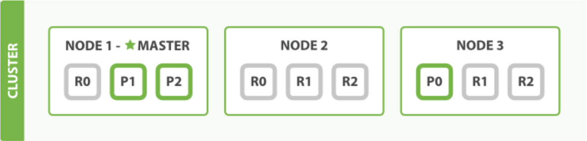

elasticsearch 이론 정리중

<br><br>

### Part 1. Elasticsearch 시작하기

-	[**Elasticsearch 기본 개념**](https://github.com/itmare/es_lecture#part-1-elasticsearch-%EC%8B%9C%EC%9E%91%ED%95%98%EA%B8%B0-1)

	-	[Elasticsearch에 대하여](https://github.com/itmare/es_lecture#elasticsearch%EC%97%90-%EB%8C%80%ED%95%98%EC%97%AC)
	-	[Elasticsearch의 용어 및 개념 정리](https://github.com/itmare/es_lecture#elasticsearch-%EC%9A%A9%EC%96%B4-%EB%B0%8F-%EA%B0%9C%EB%85%90%EC%A0%95%EB%A6%AC)

-	[**Elasticsearch 설치**](https://github.com/itmare/es#elasticsearch-%EC%84%A4%EC%B9%98)

	-	[repo 등록 설치](https://github.com/itmare/es#1-repo-%EB%93%B1%EB%A1%9D-%EC%84%A4%EC%B9%98)
	-	[RPM으로 설치](https://github.com/itmare/es#2-rpm%EC%9C%BC%EB%A1%9C-%EC%84%A4%EC%B9%98)
	-	[zip, tar로 설치](https://github.com/itmare/es#3-zip-tar%EB%A1%9C-%EC%84%A4%EC%B9%98)

-	[**Elasticsearch 기본 동작**](https://github.com/itmare/es_lecture#elasticsearch-%EA%B8%B0%EB%B3%B8-%EB%8F%99%EC%9E%91)

	-	[인덱스 생성 및 삭제, 조회](https://github.com/itmare/es_lecture#%EC%9D%B8%EB%8D%B1%EC%8A%A4-%EC%83%9D%EC%84%B1-%EB%B0%8F-%EC%82%AD%EC%A0%9C-%EC%A1%B0%ED%9A%8C)
	-	[문서 색인 및 조회](https://github.com/itmare/es_lecture#%EB%AC%B8%EC%84%9C-%EC%83%89%EC%9D%B8-%EB%B0%8F-%EC%A1%B0%ED%9A%8C)
	-	문서 갱신 및 삭제
	-	클러스터 정보 확인하기

-	**Elasticsearch 플러그인**

	-	플러그인이란?
	-	플러그인의 설치
	-	한눈에 클러스터를 보기 위한 head 플러그인 활용
	-	클러스터의 사용률을 보기 위한 HQ 플러그인 활용

<br>

### Part 2. Elasticsearch Basic Usage

-	**Elasticsearch 환경 설정 (실습)**

	-	Elasticsearch의 핵심인 elasticsearch.yml 설정
	-	힙사이즈의 중요성, jvm.options
	-	로그를 어떻게 모을 것인지 설정하는 log4j2.properties

-	**Elasticsearch 클러스터 운영**

	-	무중단 운영을 위한 rolling restart
	-	안정적인 성능 제공을 위한 샤드 분배 방법
	-	index setting
	-	미리 정의된 template으로 인덱싱하기
	-	비용을 절감하는 운영 방법 hot-warm data node

-	**Elasticsearch API 활용하기**

	-	클러스터 운영 \_cluster API
	-	클러스터 인덱스 마이그레이션 \_reindex API
	-	벌크 인덱싱 \_bulk API
	-	그 외 운영에 유용한 APIs

<br>

### Part 3. Elasticsearch Advanced Usage

-	**검색엔진으로 Elasticsearch 활용하기**

	-	인덱스 생성 과정
	-	분석기 변경 방법
	-	쿼리 생성

-	**Elasticsearch 색인 기능 최적화**

	-	필요하지 않다면 쓰지 말아야 할 기능들, \_all 필드
	-	미리 정해놓은 스키마로 리소스를 절약할 수 있는 static mapping 적용하기
	-	인덱싱 된 데이터를 검색 결과에 반영할 수 있도록 refresh_interval 변경하기

-	**Elasticsearch 검색 성능 최적화**

	-	쿼리 튜닝 하기: 검색에 유리한 튜닝방법
	-	샤드 배치 결정하기: 검색 성능을 위해 샤드 배치를 결정하는 노하우

-	**Elasticsearch 모니터링**

	-	데이터의 누락이 발생하는 순간, rejected
	-	\_cat API로 클러스터 상태 모니터링 하기
	-	\_stats API로 클러스터의 리소스 사용 지표 모니터링 하기

-	**Elasticsearch 성능 테스트**

	-	‘어떻게 해야 정확한 성능을 테스트할 수 있을까?’ 시나리오 만들기
	-	성능 테스트 환경
	-	성능 테스트 결과 해석

-	**운영에 도움을 주는 오픈소스 툴**

	-	다양한 배치 작업이 가능한 curator
	-	인덱스 데이터를 마이그레이션 할 수 있는 elasticdump
	-	쉽게 배포하고, 쉽게 작업할 수 있는 ansible
	-	한 순간도 놓치지 않고 모니터링 할 수 있는 외부 notification pusher 사용

<br><br><br><br><br><br>

---

Part 1. Elasticsearch 시작하기
==============================

---

<br><br>

Elasticsearch 기본 개념
=======================

<br><br>

### Elasticsearch에 대하여

-	Elasticsearch: 고가용성의 확장 가능한 오픈소스
-	자료 쌓아두고 필요한 자료를 빠르게 검색할 수 있도록 해주는 도구
-	RESTful방식의 Native API를 제공하고 다양한 프로그래밍 언어를 위한 API도 제공
-	Native API의 장단점
	-	장점: 쉽게 사용 가능하다.
	-	단점: Json형태의 검색문을 직접 작성해야 한다.

##### 1. Full-text 검색엔진으로서의 ES

-	루씬(Lucene)

	-	apache software재단의 검색엔진 상위 프로젝트
	-	java언어로 이루어진 정보 검색 라이브러리
	-	free open-source software, Doug Cutting에 의해 개발
	-	apache license하에 배포

-	단독 서비스

-	ES는 Shay banon이 Lucene기반으로 만든 검색엔진

-	apache 2.0 license에 의거

-	HTTP Web Interface와 Schema에 자요로운 Json형태의 도큐먼트 지원

-	준 실시간 분산형 검색엔진

##### 2. 분석엔진으로서의 ES

-	검색엔진으로서의 ES에, 몇가지 솔수션을 추가해 분석엔진으로 활용
-	semi-realtime 분석 엔진으로 사용 가능
-	beats: log나 data의 원본을 elasticsearch 로 전달
-	Logstash: 직접 log를 전다랗거나 beats에서 데이터 전달받아 파싱이나 필터링하여 es에 전달
-	kibana: es에 수집된 데이터를 통계/집계 내어 시각화


<br><br>

### Elasticsearch 용어 및 개념정리

#### Json

-	사람이 읽고 쓰기 쉬운 형태의 경량 데이터 구조
-	Key:Value의 쌍으로 사용
-	Value에는 Key:Value형태의 object나 list도 들어갈 수 있음

<br><br>

#### cluster

-	es는 클러스터로 구성, 클러스터는 하나 이상의 노드로 구성
-	사용자는 클러스터를 통해 데이터를 밀어넣고 검색요청 한다.
-	클러스터는 고유의 cluster_name과 cluster_uuid를 갖고 운영된다.

<br><br>

#### node

-	노드는 클러스터를 구성하는 es프로세스
-	서로 헬스 체크를 하거나, 실제 데이터가 인덱싱 되어 적재
-	클라이언트의 검색 요청에 의해 데이터를 리턴
-	노드는 각자의 node_name과 node_uuid를 갖는다.
-	역할에 따라 여러가지 노드로 사용

	-	master_node
		-	클러스터 구성의 기준
		-	구성 노드들의 헬스 체크를 담당
	-	data_node
		-	실제 데이터가 적재되고 클라이언트의 요청에 데이터 리턴을 담당
	-	all_node

		-	master와 data의 구분이 필요없을때, 두가지 역할을 전부 담당
		-	확장이 거의 필요없고 비용 절감을 위해 사용

	-	client_node

		-	쿼리만을 받기 위한 노드
		-	master,data,all node들이 쿼리를 받을 수 있기 떄문에 부하 분산용으로 쓰임

<br><br>

#### Index

-	
-	도큐먼트들의 모음
-	RDB의 데이터베이스와 비슷한 개념
-	여러 도큐먼트들이 하나의 인덱스에 적재
-	사전에 정의되어야 할 데이터의 타입이나 특정한 구조가 필용하지 않다면 최초 데이터가 들어올때 자동 생성된다.

<br><br>

#### Type

-	
-	타입은 인덱스의 파티션으로 사용
-	RDB의 테이블과 비슷한 개념
-	하나의 인덱스에 도큐먼트를 넣을 때 타입을 분리해서 인덱싱 가능
-	하나의 인덱스에 단일 타입 권고 (\_doc)
-	es 6.x부터 천천히 deprecated (6.0: 매핑 타입 삭제, 7.0: 완전 타입 삭제)
	-	루신엔진 특성상 인덱스(DB)에 여러개의 타입이 들어가 있어도 모든 매핑 정보가 생성되어 저장되어진다.
	-	완전 상이한 데이터가 들어 갈 경우 광장히 비효적일 수 밖에 없다.
	-	따라서 여러개의 타입이 들어가더라도 내부적으론 같기 때문에 타입을 삭제하기로 
	-	[(참고1: removal of mappings)](https://www.elastic.co/guide/en/elasticsearch/reference/master/removal-of-types.html)
	-	[(참고2: what is type and why they decided type will be deprecated)](https://medium.com/@federicopanini/elasticsearch-6-0-removal-of-mapping-types-526a67ff772)

<br><br>

#### document

-	es 저장 기본단위
-	RDB의 columns나 rows와 비슷한 개념
-	도큐먼트는 데이터로 적재될 때 Document ID를 갖는다.
-	Doc ID는 기본적으로 랜덤하게 생성되지만, 필요에 의해 사용자 정의된 값으로도 생성 가능
-	Doc ID는 데이터를 찾아가는 메타데이터라 보면 된다.

<br><br>

#### Shard

-	인덱스의 데이터를 나누는 단위
-	무한정 데이터를 인덱스에 넣다보면 문제 발생
	-	단일 노드의 디스크 볼륨 크기의 유한성으로 더 이상 저장 불가 상황이 오게 됨
	-	단일 노드의 유한한 CPU, 혹은 memory자원으로 indexing이나 searching의 성능 저하
-	이런 문제 해결위해, ES에 도입된 개념이 샤딩
-	인덱스에 들어오는 도큐멘트들을 관계형 데이터베이스처럼 컬럼별로 나누는 vertical이 아닌, 문서별로 횡(horizontal)으로 나눠 샤드에 저장
-	primary shard
	-	인덱싱되어 들어온 도큐먼트의 원본 샤드
	-	es에 도큐먼트가 인덱싱 될 때, 가장 처음 생성되는 샤드
	-	샤드에는 넘버가 있어 몇 번째 샤드인지 식별 가능
	-	한번 지정한 샤드 갯수는 불변
	-	ES 6.x기준, 별도 설정하지 않으면 5개의 primary shard가 default (7.x부터 1로 변경 예정)
-	replica shard
	-	primary shard의 복제샤드를 의미
	-	primary shard 인덱싱 후, 복제 시작
	-	replica shard에 넘버링 하여 어떤 primary shard의 복제본인지 식별 가능
	-	별도 설정하지 않으면 1개의 replica shard가 default
-	각 es shard는 Lucene 인덱스
-	단일 Lucene 인덱스가 포함할 수 있는 문서 수의 최대 한도가 2,147,483,519건
-	replica shard가 있기 때문에 샤드/노드 오류가 발생하더라도 es클러스터 고가용성이 유지된다.
-	모든 replica shard에서 병렬 방식으로 검색을 실행할 수 있으므로 검색 처리량 확장 가능
-	단점: 인덱싱 할 때 primary샤드의 복제를 하는 과정이 추가되기 때문에
	1.	I/O가 두배로 발생하기 떄문에 인덱싱 성능 저하
	2.	디스크 볼륨도 실제 도큐먼트의 두배 필요

<kbd></kdb>

-	싱글 노드에 3개의 샤드로 클러스터 구성
-	시간 지날수록, 문서는 점점 늘어난다. 결국 싱글노드의 허용 볼륨 모두 소진
-	클러스터에 더 이상 데이터 적재 불가

<kbd></kdb>

-	동일한 설정의 노드 한대 추가
-	es클러스터가 일정 샤드들을 새로 투입된 노드로 분배
-	두대의 노드가 인덱싱 및 검색 응답에 참여

<kbd></kdb>

-	노드가 한대 fail날 경우, 데이터의 안정성 보장 불가
-	복제본인 replica shard 추가

<kbd></kdb>

-	노드 한대 fail시, 남아있는 나머지 노드들의 replica shard가 primary shard로 승격됨
-	fail된 노드의 replica shard는 남아있는 나머지 노드들의 primary shard를 재복제하여 replica shard를 만듦

<br><br>

#### Segment

-	샤드는 다시 세그먼트로 나눠짐
-	도큐먼트가 인덱싱될 떄, 그 데이터가 시스템 버퍼 캐시 영역으로 적재됨
-	이후, 데이터를 디스크의 세그먼트에 기록
-	이 과정에서 refresh를 거쳐야 commit point를 생성하여 검색 가능한 상태로 전환  

<br><br>

#### es 데이터 구조


-	각각의 샤드는 루씬 인덱

<br><br>

#### RDBMS와 비교

| RDBMS    | Elasticsearch |
|:--------:|:-------------:|
|  schema  |    mapping    |
| database |     index     |
|  table   |     type      |
|   row    |   document    |
|  column  |     field     |

<br><br>

#### es 클러스터 구조

##### Cluster > node > index > type > document

-	예시1


<br><br>

-	예시2


| 이름     | 개수 |
|:--------:|:----:|
| instance |  3   |
|  index   |  1   |
|  shard   |  4   |
| replica  |  2   |

-	es는 클러스터 구조로 구성되어 있으며 샤드와 복제본의 수 설정에 따라 각 노드에 스스로 샤드를 분배하여 장애 발생 시, 데이터 손실을 최소화

<br><br><br><br><br>

<br><br>

Elasticsearch 설치
==================

-	lecture 참고

<br><br><br><br><br>

<br><br>

Elasticsearch 기본 동작
=======================

<br><br>

인덱스 생성 및 삭제, 조회
-------------------------

#### 인덱스 생성 3가지 방법

##### 1. 인덱스의 "settings"를 정의

1.	static index settings
	-	number_of_shards : primary 샤드 갯수 설정
2.	Dynamic index settings

	-	number_of_replicas : replica 샤드 갯수 설정
	-	refresh_interval : 검색 commit point를 만드는 refresh interval 설정
	-	index.routing.allocation.enable : 인덱스의 샤드들의 라우팅 허용 설정

```shell
ex)
put twitter
{
    "settings": {
            "index"{
                "number_of_shards": 3,
                "number_of_replicas": 1
            }
    }
}
```

##### 2. index의 mappings를 정의

##### 3. 사용자 정의된 도큐먼트를 인덱싱

<br><br>

문서 색인 및 조회
-----------------

-	한번 설정한 샤드 갯수는 변경 불가
-	문서는 인덱싱 될때 랜덤한 string을 doc id로 할당받거나, 사용자가 정의한 doc id로 생성됨
-	사용자는 생성된 doc id를 통해 문서를 가져올 수 있음
-	프라이머리 샤드가 항상 먼저 writing된다.
-	프라이머리 샤드의 writing이 전부 완료된 후, 리플리카 샤드로 복제를 시작한다.


-	인덱스 쓰기<br><br>

#### 문서 조회


-	조회 요청을 round robin으로 처리
-	최초 요청받은 노드가 응답 주면 좋겠지만,
-	데이터를 가진 NODE1이 계속 요청을 클라이언트에게 리턴
-	문서를 가진 다른 노드는 상대적으로 계속 유휴해지는 단점
-	요청 자체도 앞단에서 balancing 권고

<br><br>

Elasticsearch 프러그인
----------------------

Core Plugins

-	Elasticsearch 에서 공식적으로 지원하는 플러그인
-	ES 버전이 올라갈 때마다 같이 버전 업데이트가 지원됨 권고됨

Community contributed

-	개인 개발자나 회사에 의해 지원되는 플러그인

##### 대표적으로 elasticsearch-head, elasticsearch-HQ

<br><br><br><br><br><br><br><br><br><br>

---

Part 2. Elasticsearch Basic Usage
=================================

---

<br><br>

elasticsearch 환경설정
======================

### 1. static settings: elasticsearch.yml

-	elasticsearch의 핵심 설정
-	노드 별로 설정파일에 설정

<br>

-	`cluster.name`
	-	클러스터 식별 이름 설정
-	`node.name`
	-	노드 식별 이름 설정
-	`path.data`

	-	index 데이터 저장할 경로 설정 (싱글, 멀티 가능)
		-	path.data: /data1
		-	path.data: /data1,/data2
		-	멀티패스 경우, 샤드 계획 수립이 중요!!!

-	`path.logs`

	-	es 로그 저장 경로 설정
	-	app 운영 로그, es deprecated 로그, index로그, searching slow 로그

-	`Discovery`

	-	노드가 시작될 때 클러스터링의 기준이 되는 master노드를 찾아가는 과정
	-	EC2, Azure, GCE등도 지원(플러그인 필요)
	-	ping을 기반으로 동작

-	`discovery.zen.ping.unicast.hosts`

	-	동일한 클러스터 이름을 전제로 설정된 호스트 가운데 master가 결정됨
	-	master노드가 있으면 클러스터에 합류
	-	master가 없으면 지정된 호스트 중 하나가 master로 선출

-	`discovery.zen.minimum_master_nodes`

	-	최소 마스터 갯수 설정
	-	(마스터노드 갯수 / 2) + 1 개 설정
	-	해당 노드 갯수만큼 마스터가 내려가면 데이터 무결성을 위해 클러스터 중지

-	Split Brain이란?

	-	마스터 후보 노드(master eligible node) 사이에 네트워크가 단절 됐을 때, 각각의 마스터 후보 노드가 마스터로 승격되어 두개의 클러스터로 동작하는 현상
	-	클러스터 구성에서 네트워크 다널로 인해 여러개의 노드가 서로 마스터로 인식되는 증상
	-	4개의 마스터를 운영할 때에는 최소 마스터 갯수를 4/2 + 1 = 3으로 설정
	-	2대가 내려가는 순간 클러스터를 중지시켜 split brain을 방지

	

	1.	마스터 노드와 후보노드 M1과 M2,3,4를 가지고 있는 클러스터A
	2.	네트워크 단절, 각 부분에서 마스터 후보 노드가 마스터로 승격, 두개의 클러스터로 동작
	3.	네트워크 복구 되어도 데이터 비동기 문제로 인해 데이터의 손실 없이는 클러스터 복구가 불가능

<br>

-	마스터 fault

	-	마스터로 정의된 노드들은 각각 cluster state version을 갖고 있음
	-	실제 마스터가 내려가면 각각의 마스터 노드들은 zen discovery에 정의된 호스트에게 ping 체크를 시작
	-	응답이 오는 호스트 중 cluster state version이 가장 낮은 호스트를 마스터로 선출

	

	<br>

##### Network 설정

-	`http.port`
	-	http프로토콜을 통해 elasticsearch의 API를 전달할 때 사용할 포트 설정
-	`transport.tcp.port`
	-	클러스터 내에 노드들이 서로 통신을 할 때 사용할 포트 설정
	-	노드는 서로의 용량이나 샤드의 상태를 알아야하기 때문에 tcp 통신을 해야한다.

##### Node Roles 설정

-	Master-eligible Node

	-	마스터 노드로서의 역할을 할 수 있는 role이 부여된 노드

	```shell
	node.master: true
	node.data: false
	node.injest: false
	```

-	Data Node

	-	데이터가 저장되는 역할을 할 수 있는 role이 부여된 노드

	```shell
	node.master: false
	node.data: true
	node.injest: false
	```

-	Injest Node

	-	문서가 인덱싱 되기 전에 파이프라인을 통해 사전처리를 할 수 있는 role이 부여된 노드

	```shell
	node.master: false
	node.data: false
	node.injest: true
	```

-	Coordinate Node

	-	클라이언트의 요청을 받고 라우팅 및 분산만 처리할 수 있는 role이 부여된 노드

	```shell
	node.master: false
	node.data: false
	node.injest: false
	```

-	`http.cors.enabled: true`

	-	웹 브라우저에서 elasticsearch에 접근할 수 있도록 해주는 설정
	-	Head나 HQ 플러그인을 사용할 때 설정

-	`http.cors.allow-origin: "*"`

	-	웹 브라우저로 접근할 수 있는 IP ACL 설정

<br>

### 2. static settings: jvm.options

-	`Xms16g`
	-	최소 힙사이즈 크기 설정
-	`Xms16g`

	-	최대 힙사이즈 크기 설정

##### initial size와 maximum size를 동일하게 설정 권고

-	runtime에서 힙 사이즈 조정 비용이 크다.

-	heap size 조정 중 JVM이 잠시 멈출 수 있다.

##### 크면 클수록 많은 데이터를 heap에서 사용 가능

-	GC 발생 시 성능 저하 고려

##### 가능하면 물리 메모리의 50%를 넘지 않도록 권고

-	최초 인덱싱이 일어날 때 시스템 버퍼 캐시를 통해 segment로 적재

-	검색이나 어그리게이션이 일어날 때에도 heap영역에 데이터가 없으면???

	-	먼저, 버퍼 캐시에 있는 segment를 확인

-	디스크 I/O를 피하기 위한 충분한 버퍼 캐시를 확보하도록 권고

##### 32G를 넘지 않도록 권고

-	heap에 데이터를 OOP(Ordinary Object Point)구조체로 저장

-	아키텍처 별로 32bit와 64bit크기의 주소 참조

-	64bit는 메모리 참조의 영역이 넓어 성능 저하

-	최대한 32bit를 이용하기 위해 메모리 주소의 offset을 가르키는 compressed OOP를 활용

-	최대 32G까지 참조 가능

-	heap을 더 할당할 경우 자동적으로 64bit OOP를 사용

<br>

### 3. static settings: log4j2.properties

-	elasticsearch는 log4j2를 사용하여 어플리케이션 로그를 기록

##### - \$\{sys:es.logs.base_path}

-	Log 설정 디렉토리
-	`path.logs`

##### - \$\{sys:es.logs.cluster_name}

-	클러스터 이름
-	`cluster.name`

##### - \$\{sys:es.logs.node_name}

-	노드 이름
-	`node.name`

<br>

ex) <br>\$\{sys:es.logs.base_path}\$\{sys:file.separator}\$\{sys:es.logs.cluster_name}.log<br> /var/log/elasticsearch/mycluster.log

<br>

#### 로그의 종류

-	\$\{sys:es.logs.base_path}\$\{sys:file.separator}\$\{sys:es.logs.cluster_name}.log
	-	클러스터 운영로그 설정
-	\$\{sys:es.logs.base_path}\$\{sys:file.separator}\$\{sys:es.logs.cluster_name}_deprecation.log
	-	Elasticsearch 에서 수행되고 있는 Deprecated 된 기능 정보
-	\$\{sys:es.logs.base_path}\$\{sys:file.separator}\$\{sys:es.logs.cluster_name}_index_search_slowlog.log
	-	인덱스 검색 슬로우 로그 정보
-	\$\{sys:es.logs.base_path}\$\{sys:file.separator}\$\{sys:es.logs.cluster_name}_index_indexing_slowlog.log
	-	인덱스 인덱싱 슬로우 로그 정보
-	\$\{sys:es.logs.base_path}\$\{sys:file.separator}\$\{sys:es.logs.cluster_name}_access.log
	-	X-Pack auditing 로그 정보

<br>

#### elasticsearch는 많은 파일에 다량의 접근 시도

-	열 수 있는 file descriptor 가 부족하면 데이터 손실 가능성 발생

	```shell
	sudo vi /etc/security/limits.conf
	# 추가
	elasticsearch soft nofile 65536 elasticsearch hard nofile 65536
	```

-	Elasticsearch는 operations type 에 따라 많은 thread pool 을 사용

-	elasticsearch 유저가 적어도 4096 개의 프로세스를 다룰 수 있어야 함

	```shell
	elasticsearch   soft    noproc  4096
	elasticsearch   hard    noproc  4096
	```

-	elasticsearch 환경 변수가 정의되어 있는 파일`sudo vi /etc/sysconfig/elasticsearch`

-	elasticsearch 는 인덱스를 Filesystem 에 쓸 때 mmap 을 사용

	```shell
	sudo vi /etc/sysctl.conf
	# 추가
	vm.max_map_count=262144
	#/etc/sysctl.conf 파일내용 적용
	sudo sysctl -p
	```

-	Swap Disabling

	-	디스크로 swap out 이 되면 성능 저하가 발생

	```shell
	# /etc/fstab에 스왑 장치로 인식한 모든 장치를 스왑에서 해제한다.
	sudo swapoff -a
	# sysctl.conf 열기
	sudo vi /etc/sysctl.conf
	# 추가
	vm.swappiness = 1
	# 변경내용 적용
	sudo sysctl -p
	```

<br>

### 4. dynamic settings

-	클러스터에 API로 호출
-	클러스터 단위로 설정

<br><br><br><br><br>

elasticsearch 클러스터 운영
---------------------------

### Rolling Restart

-	무중단 운영을 위한 작업방법
-	시스템 작업이나 es version upgrade 를 해야하는 상황
-	replica가 있는 cluster의 경우, application restart나 system reboot을 할 때마다 cluster 내부에서는 주인을 잃은 샤드들(unassigned)이 기본 라우팅 설정에 따라서, 복구를 위해 자동으로 재분배
-	많은 노드들을 작업해야 할 때면, 이런 shard들이 재분배 되기를 기다렸다가 cluster가 green상태가 될 때 까지는, 시간 뿐 아니라 네트워크와 Disk I/O 등의 많은 리소스를 필요
-	이런 작업을 할 때, 리밸런싱이 일어나지 않게 하는 것이 Rolling Restart
-	`_cluster/settings`의 `cluster.routing.allocation.enable` 값 변경에 따른 설정 변경
	-	shard 종류에 따라 어떻게 처리 할 것인지 결정
	-	`none` : 전부다 재분배 안하겠다.
	-	`all` : 전부 재분배 하겠다.

<br>

#### 과정

1.	\_cluster API로 클러스터 라우팅 할당을 off로 변경

	```json
	PUT _cluster/settings
	{
	    "transient" : {
	        "cluster.routing.allocation.enable" : "none"
	    }
	}
	```

	

2.	작업하고자 하는 노드 중지 (itmare-data02 중지)

	-	중지된 노드의 샤드들이 unassigned 상태로 변경 (라우팅 할당을 off했으므로 리발란싱이 일어나지 않음)

	

3.	노드 재가동, 클러스터에 추가 확인

	

4.	확인 후, 라우팅 할당 on

	```json
	PUT _cluster/settings
	{
	    "transient" : {
	        "cluster.routing.allocation.enable" : "all"
	    }
	}
	```

	

	-	unassigned 샤드가 추가된 노드로 복구

5.	위의 과정 노드별 반복

<br><br>

### Shard Allocation

-	안정적인 성능 제공을 위한 샤드 분배 방법
-	es 운영 중 여러대로 구성된 클러스터에 노드별 용량이 상이해지는 경우가 발생한다.
-	생성되는 인덱스의 샤드가 노드수와 동일하다면 큰 차이가 발생하지 않겠지만, 운영하다보면 노드 증설 등으로 인해 기존에 계획한대로 샤드 배치가 되지 않는다.
-	노드에 샤드가 똑같이 분배되지 않을 때에 용량 격차가 벌어진다.

-	생성되는 index의 shard 갯수가 노드 갯수와 다를 때

	-	shard 갯수를 계획할 때, 노드 갯수를 고려해야 한다.

-	방법

	-	`POST _cluster/reroute`사용
	-	`PUT _cluster/settings`의 disk threshold 사용

<br><br>

### Index setting

#### 1.Static index settings

-	number_of_shards

#### 2. Dynamic index settings

-	운영중 인덱스 세팅 변경
-	RestAPI로 변경사항 요청
-	number_of_replicas: 운영중에 리플리카 샤드 갯수를 변경
-	refresh_interval: 세그먼트에 저장된 데이터를 검색할 수 있도 commit point 생성하는 주기
-	index.routing.allocation.enable: 데이터 노드에 샤드를 어떤 방식으로 할당할 것인지를 결정
-	routing.rebalance.enable: 데이터 노드에 샤드를 어떤 방식으로 재배치할 것인지를 결정

-	차이점?

	-	allocation: unassigned 샤드를 노드에 배치시킨다.
	-	rebalance: es가 클러스터에 존재하는 샤드들의 수를 카운트해 노드에서 노드로 재배치하며 발란싱을 맞춘다.

-	새로운 노드가 추가될때, 오래된 샤드의 움직임을 피하기위해 더 나은 셋팅 방법은?

	-	준비중???

-	other settings

	-	Analysis, Mapping, Slowlog

	-	그중, Mapping

#### Mapping

-	document가 indexing 될 때, doc과 doc에 포함된 field들을 어떻게 저장할지를 결정하는 과정
-	6.x 부터 Multi Mapping Deprecated
-	Dynamic Mapping
	-	es가 인입되는 document를 보고, 알아서 타입을 찾아 mapping
-	Static mapping
	-	사용자가 정의한 스키마를 기준으로 mapping

##### Dynamic Mapping Field

| Value Type            | mapping Field / Description         |
|:---------------------:|:-----------------------------------:|
|         null          |          No field is added          |
|     true of false     |            boolean field            |
| floating point number |              log field              |
|        object         |            object field             |
|         array         |       string or object field        |
|      data string      |        double or long field         |
|      text string      | text field with a keyword sub-field |

<br><br>

#### Template

-	미리 정의된 템플릿으로 인덱싱하기
-	익덱스가 생성될 때 사용자 정의된 세팅이나 매핑을 자동으로 적용
-	인덱스 패턴, 인덱스 세팅, 인덱스 매핑 관련 사항 정의
-	인덱스가 생성될 때 패턴이 매칭되는 인덱스는 해당 정의를 따름
-	order가 높은 번호가 낮은 번호를 override하여 merging

<br><br>

### hot-warm data node

-	elasticsearch 5.x부터,
	-	master node: 클러스터 관리 상태를 핸들링하는 노드
		-	데이터가 없다.
		-	서치 작업에 참여하지 않는다.
		-	인덱싱하지 않는다.
		-	데이터노드에 비해 적은 CPU, RAM, Disk configuration
	-	hot node: 빈번하게 호출되거나 자주 쿼리 작업하는 인덱스
		-	가장 자주 쿼리되는 가장 최신 인덱스를 홀드
		-	가장 파워풀해야하는 서버
		-	high availability를 위해 적어도 3개의 노드 추천
	-	warm node: 자주 호출되지 않는, 읽기 전용의 대용량의 인덱스를 처리
		-	자주 쿼리되지 않는 대용량 read-only 인덱스를 헨들링
		-	high availability를 위해 적어도 3개의 노드 추천
-	elk할때 사용, 검색엔진으로는 잘 안씀
-	es에선 빠른 응답을 위해 SSD 디스크를 사용하는 것을 권고
-	index가 크고 보관기간이 길명 비용 부담이 증가
-	최근 데이터를 더 자주 보는 경향을 이용한 매커니즘
-	상대적으로 비용이 저렴, 고용량인 SATA 디스크를 이용
-	elasticsearch.yml, Template, Curator 를 이용하여 운영!

<br><br><br><br><br>

elasticsearch API 활용
----------------------

-	es는 여러가지 API를 두어 온라인 상의 사용이나 운영의 편이를 도모
-	운영을 위해 클러스터 상태나 지표들을 볼 수 있는 모니터링 API
-	클러스터의 설정을 변경할 수 있는 클러스터 설정변경 API
-	데이터를 이관하거나 별칭을 달 수 있는 API 등

<br><br>

### Cluster API - 클러스터 운영 API 다루기

-	POST \_cluster/...
-	운영중인 클러스터의 세팅정보 확인이나 온라인 상태로 설정을 변경할 수 있는 API
-	자주 변경할 여지가 있는 사항들은 cluster api로 진행
-	설정 모드는 두 가지로 나뉨
	-	Transient: full cluster restart 시, 리셋되는 설정
	-	Persistent: 사용자 변경없으면, 영구 보존되는 설정, static setting보다 우선순위가 높음

### Reindex API - 데이터 마이그레이션

-	POST \_reindex
-	인덱스를 복제할 때 사용
-	원본 인덱스의 세팅이나 매핑은 복제되지 않는다.
-	클러스터 내부 뿐 아니라 외부 클러스터의 인덱스도 복제 가능

### Bulk API - 도큐먼트 한번에 인덱싱하기

-	인덱스문서의 인덱싱, 삭제, 업데이트를 벌크로 진행할 수 있는 API
-	Java, Python, Perl 등 언어별로 bulk api 라이브러리 제공[링크: bulk API](https://www.elastic.co/guide/en/elasticsearch/reference/current/docs-bulk.html)

### 그 외 운영에 유용한 API

-	\_aliases API
	-	인덱스에 별칭 부여하는 API
	-	\_reindex API와 함께 자주 사용
	-	존재하는 인덱스와 같은 이름으로는 설정 불가
-	\_forcemerge API
	-	segment를 강제로 병합하는 API
	-	인덱싱 중인 인덱스에 사용은 비추!!!
	-	인덱싱이 끝난 인덱스는 하나의 segment로 merge를 추천!!!
	-	I/O 비용이 크기 때문에 인덱싱이나 검색이 없는 시간대에 진행
-	\_open/close API
	-	인덱스의 상태를 open/close 할 수 있는 API
	-	close된 인덱스는 read/write 불가
	-	클러스터 전체 샤드에서 제외
	-	라우팅 disabled

<br><br><br><br><br><br><br><br><br><br>

---

Elasticsearch 검색엔진 활용 및 성능 최적화와 모니터링
=====================================================

---

<br>

검색엔진으로 Elasticsearch 활용하기
-----------------------------------

<br>

### 인덱스 생성 과정

-	인덱싱 필수 조건

	-	프라이머리 샤드가 항상 먼저 writing 되야 한다.
	-	primary shard의 writing이 전부 완료 되면, replica shard 복제가 된다.

-	Inverted Index

	-	인덱싱되어 들어온 문서는 inverted index형태로 segment에 저장
	-	정의된 Analyzer에 의해 tokenizing된 단어를 기준으로 indexing
	-	별도로 정의하지 않으면 기본 standard analyzer가 적용(언어 문법 기준 파싱) 
	-	1. 문서가 들어오면 analyzer가 용어별로 나열
	-	2. 용어가 몇번 들어왔는데 갯수 정리
	-	3. 용어가 몇번 문서에 있는지 metadata형태로 저장
	-	4. 세그먼트 저장되기 전에 버퍼에 저장되어있다가 리프래쉬되면 세그먼트에 쓰여진다.
	-	한줄요약: analyzer가 문서가 들어오면 문서를 쪼개서 inverted index형태로 만든 후에 세그먼트로 저장

### 분석기 변경 방법

-	Analysis

	-	text에 대해 검색이 될 수 있도록 분석하는 과정

	

	-	character filters

		-	원본 text 가공
		-	설정하지 않거나 다중으로 필터 설정 가능
		-	ex) html 태그 제거, 패턴 매칭(123-456-789 ==> 123_456_789)

	-	Tokenizer

		-	어떤 방식으로 원본 text를 tokenizing 할지 결정
		-	tokenizing 된 term은 token 이라 부름
		-	하나의 tokenizer만 설정 가능
		-	ex) space가 기준일때: You are a boy!!! ==> You / are / a / boy!!!

	-	Token filters

		-	tokenizer에 의해 결정된 koten들에 대한 가공
		-	설정하지 않거나 다중으로 필터 설정 가능
		-	ex) stopword제거: You / are / a / boy ==> you / boy

-	Analyzer

	-	default는 standard analyzer, 변경가능, 사용자 정의 analyzer 설정 가능
	-	analyzer API를 통해 분석되는 token 확인 가능

-	Analyer 가 바뀌면 token도 변경

-	검색할 단어가 바뀌므로 중간에 Analyzer를 변경하면 의도와 다른 결과 가져오게 됨

-	**Analyzer를 변경하면 반드시 \_reindex 필요**

-	참고 링크

	-	[Character filters](https://www.elastic.co/guide/en/elasticsearch/reference/6.5/analysis-charfilters.html)
	-	[Tokenizer](https://www.elastic.co/guide/en/elasticsearch/reference/6.4/analysis-tokenizers.html)
	-	[Token filters](https://www.elastic.co/guide/en/elasticsearch/reference/6.4/analysis-tokenfilters.html)

<br><br><br><br>

### 쿼리 생성

#### 검색하기

-	\_search API를 활용해 원하는 document 검색
-	URI 및 HTTP request body를 통해 쿼리 작성
-	구성
	-	Query: 문서의 위치를 찾는다.
	-	Fetch: 문서를 가져온다.

```shell
# example
GET /_search
{
	"from": 90,
	"size": 10
}
```

#### Query Phase of distributed search

-	쿼리를 받아 문서가 어떤 node의 어떤 shard에 있는지 찾는 과정
-	from, size를 계산하여 빈 queue를 생성
-	전체 node, shard에 문서가 있는지를 확인, node들도 로컬에 queue를 생성
-	queue에 검색된 문서의 id를 넣고 결과를 sorting 후 결과 리턴


1.	client는 `search` 요청을 `from + size`크기의 empty priority queue를 만드는 `node 3`에게 보낸다.
2.	`node 3`는 search 요청을 index에 있는 모든 shard의 primary와 replica 포워딩한다. 각각의 shard는 query를 local에서 실행하고, 결과를 local sorted priority queue(size = `from + size`)에 추가 시킨다.
3.	각 shard는 doc ID를 리턴하고, priority queue의 모든 doc 값을 coordinating node, `node 3`에 정렬한다. coordinating node는 그 값들을 결과값이 global하게 정렬된 리스트를 생산하기위해 자신이 소유한 priority queue안에 합친다.

#### Fetch phase of distributed search

-	리턴 받은 document ID를 기준으로 관련된 shard에 multi GET 요청
-	노드별로 리턴받은 문서를 클라이언트에게 리턴


1.	coordinating node(`node 3`)은 어떤 document가 fetch되는지를 확인하고, multi GET 요청을 적절한 shard에 발행한다.
2.	각 shard는 document를 로드하고, 그 document들을 *enriches* 한다. 그러고나섯 필요시, document들을 coordinating node에 리턴한다.
3.	모든 document가 fetch되고, coordinating node는 결과를 client에게 리턴한다.

#### URL search

-	URL에 request parameters를 통해 검색 질의
-	한정된 검색 옵션만 사용 가능 (Quick Test)
-	ex) `GET bank/_search?from=0&size=100&q=address:Fleet&sort=age:asc`
-	[URL search에 대한 더 많은 정보](https://www.elastic.co/guide/en/elasticsearch/reference/current/search-uri-request.html)

#### Request Body Search

-	Query DSL(Domain Specific Language)를 이용해 HTTP Body 정의 후, 질의
-	query 구문을 사용하여 질의
-	from과 size parameter를 이용하여 pagination한다. (크기를 정한다.)
-	default는 from:0, size:10
-	(from + size)가 기본으로는 10000까지만 허용
-	더 필요하면 index.max_result_window 조정 필요
-	[Request Body Search에 대한 더 많은 정보](https://www.elastic.co/guide/en/elasticsearch/reference/current/search-request-body.html)

<br><br><br><br>

### Query DSL (Domain Specific Language)

-	JSON 기반의 es쿼리를 정의하는 언어

#### Leaf query clause

-	자체적으로 쿼리를 할 수 있는 완성된 검색 쿼리 절
-	match, term, range 등

##### 1. Full Text Query (Query Context)

-	query를 analyze하여 검색, 스코어가 가장 높은 문서순으로 노출
-	검색 쿼리 절이 얼마나 문서에 잘 매치되는지 유사성을 확인
-	검색 쿼리와의 매칭율에 따라 `_score`를 부여
-	ex) elasticsearch 검색 => elastic에 포함된 문서, search에 포함된 문서 검색
-	match, match_phrase, match_phrase_prefix, query_string 등 사용

##### 2. Term Level Query (filter Context)

-	정확히 일치하는 용어만 검색, `_score`는 무의미
-	keyword field 기반으로 검색
-	ex) date 필드의 값이 2015년과 2018년 사이에 속해있는지, status 필드의 값이 'ok'인지
-	term, terms, range 등 사용

#### Compound query clause

-	Leaf query 및 compound query를 결합하여 multiple query를 만들거나, 쿼리의 행동을 변경한다

	-	combine multi query: bool, boosting, dis_max 등
	-	alter query: constant_score 등

-	bool Query

	-	하나 이상의 boolean clause가 사용됨
		1.	must: 문서에 일치하는 항목, 스코어 계산
		2.	filter: 문서에 일치하는 항목, 스코어 0, filter context에서 보통 실행
		3.	should: 문서에 일치하는 항목, must나 filter항목이 없으면 적어도 하나의 쿼리절과 일치되는 결과 리턴
		4.	must_not: 문서에 일치하지 않는 항목

-	[링크: Query DSL](https://www.elastic.co/guide/en/elasticsearch/reference/current/query-dsl.html)

<br><br><br><br>

Elasticsearch 색인 성능 최적화
------------------------------

-	색인은 I/O job
-	es에서 기본으로 제공하는 색인 기능 중 불필요 기능 제거
-	인덱스 mapping스키마를 미리 적절히 정의하는 것만으로도 성능 향상
-	니즈에 따라 데이터 제공 패턴을 변경하여 성능 향상

<br><br>

### 미리 정해놓은 스키마로 리소스를 절약할 수 있는 static mapping 적용하기

-	Mapping
	-	문서가 인덱싱 될때 문서와 문서에 포함된 필드들을 어떻게 저장할지를 결정하는 과정
	-	string에 대해 text field로 쓸지, keyword field로 쓸지
	-	numeric type은 short field로 쓸지, log field로 쓸지
	-	date type은 어떻게 정의해서 쓸지
-	Field Datatype
	-	field type: text, keyword, date, long, double, boolean ...
-	[참고](https://www.elastic.co/guide/en/elasticsearch/reference/current/mapping-types.html)

#### 1. text field type

-	email본문 같은 full-text로 인덱싱 되는 필드타입
-	분석기를 통해 단어로 검색 가능하도록 인덱싱됨
-	sorting에 사용되지 않음
-	aggregation에 거의 사용되지 않음

```shell
PUT text_index
{
	"mappings":{
		"_doc":{
			"properties":{
				"title":{
					"type": "text"
				}
			}
		}
	}
}
```

<br>

#### 2. keyword field type

-	email 주소나 호스트 네임같은 구조화된 컨텐츠로 인덱싱되는 필드 타입
-	Analyze 되지 않음
-	sorting, aggregation 지원
-	Exact value로만 검색된다.

```shell
PUT keyword_index
{
	"mappings": {
		"_doc":{
			"properties:"{
				"title":{
					"type": "keyword"
				}
			}
		}
	}
}
```

<br>

-	Aggregation?
	-	검색 쿼리에 의해 집계/통계를 내는 프레임 워크
	-	메일 본문같은 긴 내용은 집계/통계를 내기 어려운 데이터
	-	수치나 특정 문자로 한정된 데이터들의 집계를 내는 역할
	-	kibana에서 집계/통계를 낼 때 주로 사용

<br><br>

##### text vs. keyword

-	dyanmic mapping으로 string이 들어오면 text와 keyword 둘 다 사용 가능
-	fields로 sub field 세팅
-	sub field는 test.keyword로 질의
-	인덱싱 될 때 text는 analyzer를 거치게 된다.
-	keyword로 사용할 의도였다면 이러한 분석은 낭비
-	keyword로 사용할 string이라면 keyword type으로 매핑

| 항목             | text   | keyword |
|:----------------:|:------:|:-------:|
|      input       | String | String  |
|     analyze      |   O    |    X    |
| Full-text Search |   O    |    X    |
|     Sorting      |   X    |    O    |
|   Aggregation    |   X    |    O    |

<br>

#### 3. date field type

-	형식이 지정된 날짜가 포함 된 문자열 (ex: "2019/01/01 01:14:15")
-	milliseconds를 나타내는 epoch_millis (ex: 1546305255000)
-	허용할 타입만 지정 또한 가능하다.

```shell
PUT date_index
{
	"mapping": {
		"_doc":{
			"properties":{
				"date":{
					"type": "date"
				}
			}
		}
	}
}
```

<br>

#### 4. Numeric field type

-	숫자 형식의 필드 타입
-	적절하게 맞추면 좋으나 동일 타입으로 통일을 권고
-	dynamic 매핑은 long

| Value Type   | Supported                                      |
|:------------:|:----------------------------------------------:|
|     long     |        64-bit integer (-2^63 ~ 2^63-1)         |
|   integer    |        32-bit integer (-2^31 ~ 2^31-1)         |
|    short     |       16-bit integer (-32,768 ~ 32,767)        |
|     byte     |           8-bit integer (-128 ~ 127)           |
| double/float | 64-bit \ 32-bit IEEE 754 floating point number |

<br>

### hierachiacl nature of JSON field type

-	object 나 list같이 게층구조의 데이터는 properties 라 불리는 서브 필드에 포함된다.
-	properties는 서브필드로 활용
-	매핑을 정의해서 인덱스를 만들때
-	매핑타입을 추가할 때
-	매핑을 정의하지 않고 문서를 인덱싱 할 때 Elasticsearch가 dynamic하게 매핑을 정의할 때

#### 5. object field type

-	`object` for single JSON objects

#### 6. nested field type

-	`nested` for arrays of JSON objects
-	`nested`로 정의한 매핑은 인덱싱이 되는 순간 다시 dynamic mapping으로 인덱싱
-	static mapping으로 별도 지정

<br><br><br>

### 필요하지 않다면 쓰지 말아야 할 기능들, \_all 필드

-	도큐먼트의 모든 필드의 value를 합쳐서 인덱싱하는 필드
-	검색할 때 사용되며, 세그먼트에 저장되지는 않지만 힙 영역에 올라가는 데이터
-	text field로 analyze 되는 필드 (text field로 저장됨)
-	6.0부터 deprecated (가급적 안쓰는게 좋음)
-	\_all field를 5버전 이하에서 사용한다면 disable 권고
-	탬플릿에 `_default_`type을 통해 전체 인덱스 disable
-	key/value 형태로 저장해서 검색하는 걸 권고

```json
PUT twitter
{
	"mappings":{
		"_default_":{
			"_all":{
				"enabled":false
			}
		}
	}
}
```

<br><br>

### 인덱싱 된 데이터를 검색 결과에 반영할 수 있도록 refresh_interval 변경하기

-	메모리 캐시 버퍼 영역으로부터 세그먼트에 도큐먼트를 저장하는 주기
-	refresh가 되어, 저장된 도큐먼트는 검색 가능한 상태로 변경된다.
-	온라인상에서 인덱스별 세팅 가능
-	-1로 설정하면 disable, null로 설정하면 1s로 초기화
-	주로 bulk indexing할 때 -1로 설정하고 사용
-	interval을 길게 가져갈수록 I/O 빈도가 낮아져 성능 향상
-	메모리 버퍼의 용량을 고려하여 interval을 설정

<br>

##### \*\*\* -1로 설정했음에도 refresh thread가 증가 하는 상황 \*\*\*

-	기본적으로 -1 설정은 bulk indexing 할때, refresh action을 수행하지 못하게 하기 위해
-	refresh thread 확인 (증가 시, mapping정보에서 dynamic field에 따른 template 구성이 영향을 줄 수 있음)
-	dynamic field설정으로 indexing 할때, mapping정보가 바뀌게 되고 이를 반영 하기위해 IndexService가 updateMetaData()를 수행한다. 이 과정에서 자동으로 refresh가 발생하므로, bulk request 시, 어떤 구성을 하였는지 먼저 분석해야 한다.

<br><br>

### 그밖의 색인 성능 최적화

#### Document id 없이 POST로 인덱싱 권고

-	PUT을 통해 doc id를 설정한 채로 인덱싱을 할때 es는 해당 id의 문서가 있는지 먼저 체크
-	문서가 많아질수록, 인덱스가 커질수록 해당 부하가 커짐

#### Bulk Indexing 활용 권고

-	가능하면 단일 인덱싱 요청보다는 한번에 많은 문서를 Bulk indexling하는것이 더 효율적
-	단일 노드, 단일 샤드 환경에서 적절한 bulk size 측정 후 진행 권고
-	request reject나 gc상황을 봐가며 적정 수치 확인

<br><br><br><br>

Elasticsearch 검색 성능 최적화
------------------------------

### 쿼리 튜닝 하기: 검색에 유리한 튜닝방법

-	numeric field에 대해 keyword field로 인덱싱 고려
	-	검색과 range필드 쿼리는 가능
	-	집계 등의 수치 계산 불가능
-	wildcard 사용에 대해 충분히 검토 필요
	-	token으로 분리되는 용어는 wildcard 대신 match를 써도 충분
-	exact match 검색을 할때에는 match 대신 term쿼리 사용
	-	불필요한 analyze를 제외하여 성능 향
-	query context와 filter context를 적절히 활용
	-	filter context쿼리는 스코어가 의미가 없는 쿼리
	-	filter절에 넣어 스코어를 계산하는 단계를 없애면 성능 향상
-	bool 쿼리는 쿼리가 정이된 순서대로 실행
	-	최상단에 정의된 쿼리에 결과 범위를 가장 좁힐 수 있는 쿼리를 두는게 좋다.

<br>

-	서비스 전, 쿼리 캐시 warm-up

	-	처음 로딩되는 데이터는 heap에 올라와있지 않다면 버퍼 캐시에 데이터가 있는지 확인
	-	버퍼캐시에도 없다면 디스크에 저장된 segment를 찾아 heap에 데이터를 올리고 리턴
	-	자주 사용되는 쿼리가 짐작된다면 서비스 전에 미리 쿼리를 날려두어 heap에 데이터를 로딩
	-	전체 데이터가 로딩될 만큼 힙 사이즈가 크다면 와일드카드 쿼리로 전체 데이터를 로딩

<br><br>

### 샤드 배치 결정하기: 검색성능을 위해 샤드를 배치하는 노하우

-	**한번 설정한 샤드 갯수는 변경 불가**
	-	처음부터 샤드 갯수를 잘 설정해야 클러스터 성능이 좋아짐
-	샤드 갯수 결정 시, 고려해야 할 점
	1.	**인덱스가 생성될 때, 전체 노드가 인덱싱과 검색에 참여할 수 있는가?**
		-	분산처리를 위해 샤드가 노드에 고루 분배되어야 함
		-	노드 갯수의 배수로 샤드 갯수를 가져가면 노드 별 용량도 비숫하게 수렴됨
	2.	**하나의 데이터 노드에 적당한 샤드 갯수가 저장되도록 설계되었는가?**
		-	Heap size 1GB의 Heap 당, 20~25개 정도의 샤드 설정
		-	데이터노드에 heap size를 16G정도로 설정, 노드 당 320~400 정도의 샤드 설정
		-	es커뮤니티에서 권고하는 일반 설정
		-	노드 당 300개의 샤드를 넘지 않도록 권고(굉장히 쾌적히 쓸수 있는 일반적인 사항)
		-	use case 별로 상이할 수 있음
	3.	**하나의 샤드가 적절한 용량만 저장되도록 설계되었는가?**
		-	하나의 샤드 적정 크기는 보통 20~40GB를 권고 (50GB는 절대 넘기지 말도록 권고한다)
		-	작을수록 좋지만 너무 작게 나누면 적체 샤드갯수가 증가 (2번 조건과 상충)
		-	인덱스 전체 크기가 산정되면 하나의 샤드 크기가 적절하게 나눠질 수 있도록 설정
			-	ex) 매일 저장되는 인덱스의 총 크기가 500G ==> 샤드 1개가 20G만 가져갈 수 있도록 25개의 샤드 세팅
	4.	**클러스터의 전체 샤드 갯수는 적절한가?**
		-	클러스터 전체 샤드 갯수가 늘면 그만큼 클러스터 내 노드가 알고 있어야 하는 정보들도 많아짐
		-	실제 운영 환경에서 20,000개가 넘어가는 순간부터 성능이 급격히 감소
	5.	**꼭 실시간으로 replica shard가 필요한가?**
		-	replica shard는 실제 문서만큼의 추가 복제 비용이 발생
		-	원본이 별도로 있다면 인덱싱 될 때는 replica를 없애면 성능 향상
		-	데이터 유실의 위험이 있으니 상황을 잘 고려하여 판단

#### 클러스터 sizing 시나리오

-	조건

	1.	daily로 400G 정도로 인덱싱되는 문서가 들어올 예정
	2.	데이터 보존을 위해 replica 필요
	3.	10일 정도 데이터 보존 희망

-	sizing 진행사항

	1.	먼저, 총 클러스터 인덱스 용량을 산정
	2.	400GB x 2(primary/replica) x 10 days = 8TB
	3.	하나의 샤드에 20G 적재로 산정, 20개의 primary 샤드 산정
	4.	클러스터 전체 샤드 갯수는 20 x 2(p/r) x 10 = 400
	5.	디스크가 SSD 2T라고 가정하면 8TB를 저장하고 20%정도 여유 용량 확보를 위해 5대 구매
	6.	인덱스 샤드가 replica 포함 총 40개이므로, 노드 당 샤드 8개 할당됨
	7.	하루 400GB의 인덱스를 모두 힙과 버퍼에 담으려면 총 800G의 메모리 필요
	8.	5대로 나누면 160G의 메모리 필요 (이렇게 커지면 하루 데이터 모두를 메모리에 담는 것은 포기)
	9.	OOP 구조체를 고려하여 64GB 메모리로 구매, heap을 30G로 설정
	10.	노드 당 heap 30GB에 10일 전체 샤드는 80GB (1GB 당 3개 미만)

#### \_forcemerge API

-	segment를 강제로 병합하는 API
-	인덱싱 중인 인덱스에는 사용 **비추**
-	인덱싱이 끝난 인덱스는 하나의 segment로 merge를 추천
-	I/O비용이 크기 때문에 인덱싱이나 검색이 없는 시간대에 진행

#### Routing

-	routing key를 통해 특정 샤드로 인덱싱하는 방법
-	routing key를 인덱싱 샤드 할당 알고리즘을 통해 할당
	-	shard = hash(routing) % number_of_primary_shards
-	routing key에 의해 특정 샤드로 들어간 데이터는 검색 시에 검색이 아닌 문서 가져오기 과정을 거쳐 성능이 향상됨
	-	ex)
		1.	메일 서비스 검색엔진을 es로 사용하고, 사용자별로 메일을 검색
		2.	사용자 id를 routing key로 주고 메일 본문을 인덱싱
		3.	검색시에 사용자 id를 routing key로 찾으면 특정 샤드만 검색

#### Rollover API

-	준비중

.

.

.

.

<br><br>

ELK 스택으로 활용하기 Elasticsearch 모니터링
--------------------------------------------

### rejected

-	데이터의 누락이 발생하는 순간
-	노드 내에서 스레드의 메모리 사용을 관리하기 위 여러개의 스레드풀 사용
-	index, get, search, write(bulk)등 여러개의 스레드풀 존재
-	각각의 스레드풀은 대기열 큐를 두어 대기중인 요청을 보관
-	`GET _node/thread_pool`

| 구분             | index   | get     | search               | write(bulk) |
|------------------|---------|---------|----------------------|-------------|
| Thread pool size | core 수 | core 수 | (core수 x 3 / 2) + 1 | core 수     |
| Queue size       | 200     | 1000    | 1000                 | 200         |

-	대기열큐가 꽉차면 그 이후부터는 요청이 reject됨

-	`_nodes/stats`를 통해 모니터링

-	`_cat/thread_pool?v`을 통해 thread_pool 정보만 조회 가능

-	elasticsearch.yml 파일에 큐 사이즈 조절 관련 property 추가 가능

	```shell
	thread_pool.bulk.queue_size: 10000
	thread_pool.search.queue_size: 10000
	```

### Cat API

-	클러스터의 여러가지 상태 살펴보기

### Stats, Nodes API

-	클러스터의 리소스 사용 지표 확인하기

```shell
단위별
```

.

.

.

.

.

.

.

.

.

.

.

.

.

<br><br><br><br><br>

추가자료
========

Per-License Supports
--------------------

-	For more details on [HERE](https://www.elastic.co/subscriptions)


<br><br>

About Mapping type and deprecated
---------------------------------

-	[링크](https://www.elastic.co/guide/en/elasticsearch/reference/current/removal-of-types.html#_why_are_mapping_types_being_removed)

### mapping type은 무엇인가?

-	es가 릴리즈된 이래에서, 각 document는 single index에 저장되었고, single mapping type에 할당되었다.
-	mapping type document의 type 또는 인덱스된 entity를 표현하는데 사용되었다. 예를들어 `twitter` index는 `user` type과 `tweet` type을 가진다.
-	각각의 mapping type은 그것들이 소유한 field를 가질 수 있고,
	-	`user` type은 `full_name`, `user_name` 그리고 `email` field를 가질 수 있고
	-	`tweet` type은 `content`, `tweeted_at` 그리고 `user_name` field(`user` type의 것과 같이) 가질 수 있다.
-	각 document는 type name을 포함하는 `_type` meta-field를 가지고, searches는 URL에 있는 type name을 명시함으로써 하나이상의 type으로 제한 될 수 있다.

```shell
GET twitter/user,tweet/_search
{
  "query": {
    "match": {
      "user_name": "kimchy"
    }
  }
}
```

-	`_type` field는 `_uid` field를 생성하기 위해 document의 `_id`와 결합되고, 같은 `_id`와 함께 다른 type의 document들은 single index에 존재할 수 있다.
-	mapping type은 또한 document간에 [parent-child relationship](https://www.elastic.co/guide/en/elasticsearch/reference/current/mapping-parent-field.html)을 만들수 있고, type `question`의 document들은 type `answer`의 document들의 부모일 수 있다.

<br><br><br>

### 왜 mapping type이 제거될 예정인가?

-	일반적으로 index는 database, type은 table과 비슷하다고들 말한다.
-	그렇지만, 이건 정확한 설명이 될 수 없다.
-	sql db에서 table은 서로 독립적이다.
-	한 table에 있는 column은 다른 table의 같은이름을 가진 column과 관련을 가지고 있지 않다.
-	이것은 mapping type에서 field와는 다른 경우이다.

<br>

-	같은 index내에서 \_type이 다르더라도 같은 이름의 field를 갖는다면, 루신의 특징에 의해 내부적으로 하나의 field로 관리된다.
-	다른 mapping type에서 같은 이름을 가진 field들은 내부적으로 같은 루씬 field의 도움을 받는다.
-	위에서, 각각의 `user_name`field는 하나로 mapping된다. (table은 각자 따로 저장됨)
-	`user` type에서 `user_name` 데이터를 바꾸거나 타입을 바꾸면, 문제가 될 수 있다.
-	공통 field가 별로 없는 데이터를 하나의 index에 넣는 것은 효율적으로 document를 압축시키지 못한다.
-	이런 이유로, elastic은 es로부터 mapping type의 컨셉을 제거하기로 결정


<br><br><br>

### 대처 방안

#### 1. type별로 index생성

-	type별로 index를 생성하면, 기존의 방식보다 루신의 데이터 압축이 잘 되는 장점
-	tweets와 users데이터를 `twitter` index에 저장했던거와 다르게, 각각의 인덱스에 저장
-	각각의 인덱스는 완벽하게 서로 독립적이기 때문에 인덱스간 field type의 충돌걱정은 할필요 없다.
-	두가지 benefits
	-	data는 루씬에서 사용된 압축기술의 장점을 얻을 수 있다.
	-	full-text search에서 스코어링을 위해 사용된 term관련 통계가 더 정확할 것이다. (왜냐하면 같은 index에 있는 모든 documents가 싱글 entity를 표현한다.)

#### 2. custom type

-	기존에 사용하던 `_type`을 사용하지 않고, 각 document별로 docType과 같이 type을 구분할 수 있는 field를 넣어준다.
